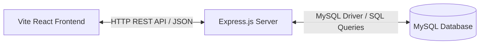

# 🌿 CLAUDE.md - AI & Development Rules (Supabase to MySQL Migration)

Dokumen ini berisi panduan pengembangan, perintah CLI, arsitektur, dan pedoman migrasi dari database **Supabase (PostgreSQL RPC)** ke **MySQL (Node.js/Express Backend)** untuk proyek Bank Sampah Bakti Alam.

---## 🚀 Perintah Dasar (Commands)

### Frontend (Vite + React)

- **Instalasi Dependensi**: `cd frontend && npm install`
- **Menjalankan Dev Server**: `cd frontend && npm run dev` (berjalan di `http://localhost:5173`)
- **Membangun Bundle Produksi**: `cd frontend && npm run build`
- **Menjalankan Linter**: `cd frontend && npm run lint`

### Backend (Node.js + Express + MySQL)

- **Instalasi Dependensi**: `cd backend && npm install`
- **Menjalankan Server Dev**: `cd backend && npm run dev` atau `cd backend && nodemon server.js`
- **Menjalankan Server Prod**: `cd backend && node server.js`

---

## 🏗️ Target Arsitektur (Client-Server Architecture)

Karena browser tidak dapat terhubung langsung ke MySQL secara aman (tanpa membocorkan kredensial database), proyek ini harus dimigrasi dari _Direct Supabase Client_ ke **Client-Server Architecture**:



### 1. Penjabaran Detail Struktur Folder Projek

Berikut adalah rincian lengkap dari seluruh direktori dan file dalam projek setelah dibagi menjadi dua folder utama (`frontend` dan `backend`):

```
bakti-alam-skripsi/
│
├── backend/                             # 💻 [NEW] Backend Express (Node.js & MySQL)
│   ├── config/
│   │   └── db.js                        # Pool koneksi database menggunakan mysql2/promise
│   ├── controllers/                     # Penanganan logika bisnis (pengganti RPC plpgsql Supabase)
│   │   ├── authController.js            # Registrasi nasabah, login, dan pembuatan token reset password
│   │   ├── userController.js            # CRUD data nasabah oleh admin
│   │   ├── depositController.js         # CRUD transaksi setoran (termasuk multiple items)
│   │   ├── priceController.js           # Penyesuaian daftar harga 8 jenis sampah oleh admin
│   │   └── notificationController.js    # Pengelolaan notifikasi real-time & polling
│   ├── routes/                          # Definisikan endpoint routing REST API
│   │   ├── auth.js                      # Route /api/auth/* (login, register, forgot-password)
│   │   ├── users.js                     # Route /api/users/* (get, update, delete)
│   │   ├── deposits.js                  # Route /api/deposits/* (get, add, update, delete)
│   │   ├── prices.js                    # Route /api/prices/* (get, update)
│   │   └── notifications.js             # Route /api/notifications/* (get, add, read, clear)
│   ├── middleware/
│   │   └── auth.js                      # Validasi session token dari database `app_sessions`
│   ├── package.json                     # Depedensi server (express, mysql2, cors, bcrypt, dotenv)
│   └── server.js                        # Entry point Express Server, setup middleware & endpoint utama
│
├── frontend/                            # 🎨 [NEW] Frontend React (Vite) - Pindahan dari Root
│   ├── src/                             # Folder kode sumber React
│   │   ├── api/
│   │   │   └── client.js                # Service API Client (pintu gerbang fetch API ke backend)
│   │   ├── components/                  # Folder Komponen React (Mengacu pada Konsep Atomic Design)
│   │   │   ├── Elements/                # Atoms: Komponen UI dasar terkecil (e.g., Button, Input, Badge, Spinner, ModernDatePicker)
│   │   │   ├── Fragments/               # Molecules/Organisms: Gabungan elemen UI (e.g., Form setoran, Card statistik, Row tabel, Notifikasi)
│   │   │   ├── Layout/                  # Templates: Layout struktur halaman (e.g., Sidebar, Header wrapper, DashboardLayout)
│   │   │   └── pages/                   # Pages: Halaman utama penyatu fragments & layout menjadi views utuh
│   │   │       ├── LoginPage.jsx        # Halaman login multi-role dengan Quick Login demo
│   │   │       ├── AdminDashboard.jsx   # Halaman Dashboard Admin (CRUD, Recharts, VIKOR, Laporan Cetak)
│   │   │       ├── UserDashboard.jsx    # Halaman Dashboard Nasabah (Grafik Saldo, Riwayat Setoran, Info Harga)
│   │   │       ├── ResetPasswordPage.jsx# Halaman pergantian sandi nasabah via token email/link
│   │   │       ├── MobileAppUI.jsx      # Komponen prototype demo UI Mobile App
│   │   │       └── ModernDashboard.jsx  # Komponen prototype demo UI dashboard alternatif
│   │   ├── utils/                       # Helper Functions & Algoritma Utama
│   │   │   ├── vikorAlgorithm.js        # Implementasi lengkap algoritma MCDM VIKOR (Kriteria, S, R, Q, Rank)
│   │   │   ├── vikorDemo.js             # Script simulasi langkah algoritma VIKOR untuk console browser
│   │   │   ├── notification.js          # Manajemen event notifikasi lokal browser
│   │   │   └── localStorage.js          # Backup penyimpanan lokal (dipakai saat mode offline/mock)
│   │   ├── lib/
│   │   │   └── supabase.js              # (DEPRECATED) Client Supabase lama, akan dihapus setelah migrasi selesai
│   │   ├── App.css                      # Custom global CSS style
│   │   ├── index.css                    # Pusat Design System (Green eco-theme, Glassmorphism, animations)
│   │   ├── App.jsx                      # Router utama frontend (pemisahan halaman berdasarkan role & token)
│   │   └── main.jsx                     # React mount entry point ke DOM
│   ├── public/                          # Aset statis frontend (Gambar, Logo, Icon)
│   ├── .env                             # Environment variable frontend (Konfigurasi URL API)
│   ├── package.json                     # Dependensi frontend React & Vite
│   ├── vite.config.js                   # Konfigurasi bundler Vite
│   └── index.html                       # HTML Template utama frontend
│
├── README.md                            # Setup dokumentasi umum
├── PROJECT_SUMMARY.md                   # Status kelengkapan fitur dan data nasabah demo
├── COMMAND_LINE_GUIDE.md                # Panduan eksekusi algoritma VIKOR via console browser
├── VIKOR_RANKING_RESULTS.md             # Dokumen analisis komparatif performa ranking nasabah
└── CLAUDE.md                            # Panduan utama AI, Skema SQL, dan aturan coding
```

---

## 🗄️ Skema Database MySQL (MySQL Dialect Schema - phpMyAdmin)

Proyek ini menggunakan **MySQL** dengan **phpMyAdmin** sebagai alat manajemen database (misalnya melalui XAMPP, Laragon, atau server hosting).

### 🛠️ Langkah Setup & Import via phpMyAdmin:

1. Buka panel phpMyAdmin Anda (contoh: `http://localhost/phpmyadmin`).
2. Buat database baru dengan nama `banksampah_bakti_alam` dengan collation `utf8mb4_general_ci`.
3. Klik tab **SQL** pada database tersebut, lalu paste dan jalankan seluruh query SQL di bawah ini.
4. **Penting**: Pastikan MySQL/MariaDB yang di-hosting phpMyAdmin Anda mendukung tipe data `JSON` (MySQL 5.7.8+ atau MariaDB 10.2.7+). Jika tidak mendukung, ubah tipe `JSON` pada tabel `deposits` menjadi `LONGTEXT`.

Berikut adalah skema SQL MySQL untuk dijalankan di phpMyAdmin:

```sql
-- Create Database
CREATE DATABASE IF NOT EXISTS banksampah_bakti_alam;
USE banksampah_bakti_alam;

-- 1. Table: users
CREATE TABLE IF NOT EXISTS users (
  id VARCHAR(36) PRIMARY KEY,
  username VARCHAR(50) UNIQUE NOT NULL,
  name VARCHAR(100) NOT NULL,
  email VARCHAR(100) UNIQUE NOT NULL,
  rt VARCHAR(10) NULL,
  password VARCHAR(255) NOT NULL,
  role VARCHAR(10) NOT NULL DEFAULT 'user',
  reset_password_token VARCHAR(255) NULL,
  reset_password_expires DATETIME NULL,
  created_at TIMESTAMP DEFAULT CURRENT_TIMESTAMP,
  CONSTRAINT chk_role CHECK (role IN ('user', 'admin'))
) ENGINE=InnoDB DEFAULT CHARSET=utf8mb4;

-- 2. Table: deposits
CREATE TABLE IF NOT EXISTS deposits (
  id VARCHAR(36) PRIMARY KEY,
  user_id VARCHAR(36) NOT NULL,
  items JSON NOT NULL, -- Menyimpan array barang setoran [{type: 'cardboard', weight: 5}]
  total_amount DECIMAL(15,2) NOT NULL DEFAULT 0.00,
  date DATE NOT NULL,
  status VARCHAR(20) DEFAULT 'completed',
  priority VARCHAR(20) DEFAULT 'normal',
  created_at TIMESTAMP DEFAULT CURRENT_TIMESTAMP,
  FOREIGN KEY (user_id) REFERENCES users(id) ON DELETE CASCADE
) ENGINE=InnoDB DEFAULT CHARSET=utf8mb4;

-- 3. Table: notifications
CREATE TABLE IF NOT EXISTS notifications (
  id VARCHAR(36) PRIMARY KEY,
  user_id VARCHAR(36) NOT NULL,
  title VARCHAR(255) NOT NULL,
  message TEXT NOT NULL,
  type VARCHAR(50) NOT NULL DEFAULT 'info',
  is_read BOOLEAN DEFAULT FALSE,
  created_at TIMESTAMP DEFAULT CURRENT_TIMESTAMP,
  FOREIGN KEY (user_id) REFERENCES users(id) ON DELETE CASCADE
) ENGINE=InnoDB DEFAULT CHARSET=utf8mb4;

-- 4. Table: app_sessions
CREATE TABLE IF NOT EXISTS app_sessions (
  token VARCHAR(255) PRIMARY KEY,
  user_id VARCHAR(36) NOT NULL,
  expires_at DATETIME NOT NULL,
  created_at TIMESTAMP DEFAULT CURRENT_TIMESTAMP,
  FOREIGN KEY (user_id) REFERENCES users(id) ON DELETE CASCADE
) ENGINE=InnoDB DEFAULT CHARSET=utf8mb4;

-- 5. Table: waste_prices (Untuk menyimpan harga sampah dinamis yang bisa di-update admin)
CREATE TABLE IF NOT EXISTS waste_prices (
  `type` VARCHAR(50) PRIMARY KEY, -- Contoh: 'plastic', 'cardboard', dll.
  price DECIMAL(10,2) NOT NULL DEFAULT 0.00,
  updated_at TIMESTAMP DEFAULT CURRENT_TIMESTAMP ON UPDATE CURRENT_TIMESTAMP
) ENGINE=InnoDB DEFAULT CHARSET=utf8mb4;

-- Seeding Data Awal Harga Sampah (8 Jenis default)
INSERT INTO waste_prices (`type`, price) VALUES
('plastic', 3000.00),
('cardboard', 2000.00),
('book', 1500.00),
('metal', 5000.00),
('mixed', 1000.00),
('electronic', 8000.00),
('oil', 2500.00),
('oilWaste', 3500.00)
ON DUPLICATE KEY UPDATE price=VALUES(price);

-- Seeding default Admin (Password: admin123)
-- Catatan: Simpan hash bcrypt asli di produksi.
INSERT INTO users (id, username, name, email, password, role)
VALUES (
  'admin-1',
  'admin',
  'Admin Bakti Alam',
  'admin@baktialam.com',
  '$2b$10$X8O9.U6WlHegCg9XbUvBRee2Qk422t4EaE2FvK1c7wPqBfG5V4Q22', -- Hash dari 'admin123'
  'admin'
) ON DUPLICATE KEY UPDATE username=VALUES(username);
```

---

## 🛠️ Pedoman Migrasi Kode (Migration Guidelines)

### 1. Migrasi Endpoint Frontend (`frontend/src/api/client.js`)

Ubah cara komunikasi dari Supabase client (`supabase.rpc`) ke backend REST API Express menggunakan HTTP client (`fetch` atau `axios`).

#### Sebelum (Supabase RPC):

```javascript
const rpc = async (functionName, params = {}) => {
  const { data, error } = await supabase.rpc(functionName, params);
  if (error) throw error;
  return data;
};
```

#### Sesudah (Express REST API):

```javascript
const API_URL = import.meta.env.VITE_API_URL || "http://localhost:5000/api";

const request = async (method, path, body = null) => {
  const headers = {
    "Content-Type": "application/json",
    Authorization: `Bearer ${getToken()}`,
  };

  const options = {
    method,
    headers,
  };

  if (body) {
    options.body = JSON.stringify(body);
  }

  const res = await fetch(`${API_URL}${path}`, options);
  const data = await res.json();

  if (!res.ok) {
    return { success: false, message: data.message || "Request failed" };
  }
  return data;
};

export const apiClient = {
  login: async (username, password) => {
    return request("POST", "/auth/login", { username, password });
  },
  getUsers: async () => {
    const res = await request("GET", "/users");
    return Array.isArray(res) ? res : res.data || [];
  },
  // Mapping endpoint lainnya disesuaikan...
};
```

### 2. Penggantian Fungsi RPC Supabase ke Express Controllers

Semua fungsi logic Postgres (`plpgsql`) dalam `supabase_direct_schema.sql` harus ditulis ulang sebagai route & controller di Express menggunakan Node.js.

- `app_login` → `POST /api/auth/login` (Gunakan `bcrypt.compare` untuk mencocokkan password).
- `app_register` → `POST /api/auth/register` (Gunakan `bcrypt.hash` untuk mengamankan password baru).
- `app_get_users` → `GET /api/users` (Verifikasi token session admin sebelum query database).
- `app_get_deposits` → `GET /api/deposits` (Dapatkan semua data setoran nasabah dengan join tabel users).
- `app_add_deposit` → `POST /api/deposits` (Simpan array items sebagai string JSON di MySQL).

---

## 🎨 Standar Desain & Koding (Code Style Rules)

1.  **Keamanan**:
    - **Jangan Pernah** melakukan query MySQL langsung dari frontend.
    - Semua koneksi MySQL dilindungi dengan enkripsi password menggunakan `bcrypt` di backend.
    - Setiap request yang membutuhkan otentikasi wajib mengirimkan `session_token` via header `Authorization`.
2.  **Bahasa pemrograman**:
    - Frontend: Javascript ES6+ (React Hooks, JSX).
    - Backend: Javascript Node.js (CommonJS atau ES Modules).
3.  **Variabel & Environment**:
    - Gunakan `.env` untuk menyimpan konfigurasi sensitif (kredensial database, JWT secret/session settings).
    - `VITE_API_URL` digunakan di frontend untuk menembak host Express server backend.
4.  **Akurasi Algoritma VIKOR**:
    - Perhitungan MCDM VIKOR ada pada file [vikorAlgorithm.js](file:///c:/Users/VERO/OneDrive/Desktop/banksampah/bakti-alam-skripsi/frontend/src/utils/vikorAlgorithm.js). Data yang dikirim dari API baru harus memiliki struktur yang kompatibel dengan format lama agar algoritma perankingan tetap bekerja 100% akurat.
5.  **Notifikasi Real-time**:
    - Tetap pertahankan mekanisme polling API di dashboard nasabah untuk menarik notifikasi baru setiap 5 detik.
