# Panduan Perancangan Diagram UML
# Sistem Informasi Bank Sampah Bakti Alam Digital

Dokumen ini berisi rancangan blueprint dan alur diagram UML yang dibutuhkan untuk pengembangan serta penyusunan dokumen teknis (seperti skripsi/tugas akhir) pada aplikasi Bank Sampah Bakti Alam Digital.

---

### Ringkasan Diagram yang Harus Dibuat

| No | Jenis Diagram | Jumlah | Cakupan Utama | Tool yang Direkomendasikan |
|---|---|---|---|---|
| 1 | **Use Case Diagram** | 1 | Hak akses Admin & Nasabah | Draw.io / StarUML |
| 2 | **Activity Diagram** | 6 | Alur bisnis utama sistem | Draw.io / Lucidchart |
| 3 | **Sequence Diagram** | 13 | Interaksi objek (frontend-backend-db) | PlantUML / Draw.io |
| 4 | **Class Diagram** | 1 | Struktur kelas & entitas data | StarUML / Draw.io |
| 5 | **Communication Diagram** | 4 | Kolaborasi antar objek/pesan | Draw.io / StarUML |
| 6 | **ERD (Entity Relationship)** | 1 | Desain database & kardinalitas | dbdiagram.io / MySQL Workbench |
| 7 | **Deployment Diagram** | 1 | Topologi arsitektur infrastruktur fisik | Draw.io |
| **Total** | | **27 diagram** | | |

---

## 📌 A. USE CASE DIAGRAM

### UC-01 — Use Case Diagram Sistem Informasi Bank Sampah (Combined)
Aktor: **Admin** & **Nasabah**
Deskripsi: Menggambarkan seluruh fungsionalitas sistem informasi bank sampah serta batasan akses untuk masing-masing peran (Admin dan Nasabah).

#### Kode PlantUML (Combined Use Case)
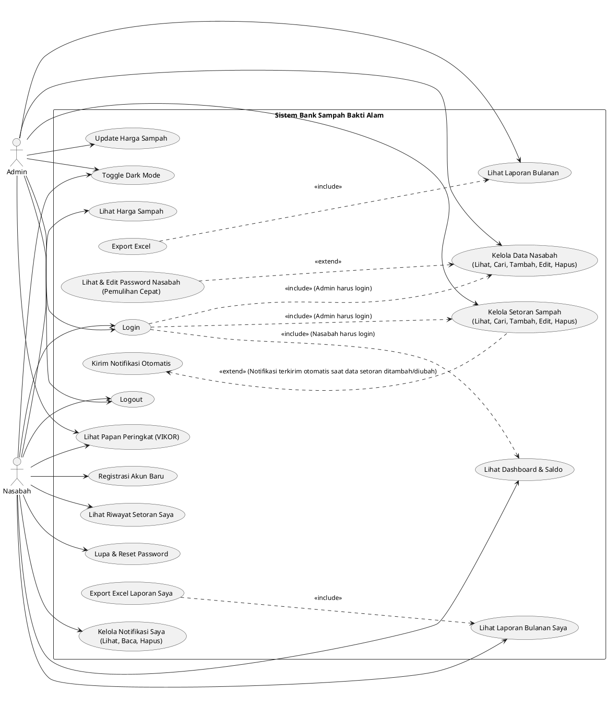

#### Struktur Batasan Otoritas Akses
```
┌──────────────────────────────────────────────────────────────────┐
│                      SHARED USE CASES (BERSAMA)                  │
│  • Login                 • Logout                • Toggle Dark   │
│  • Lihat Harga Sampah    • Lihat Peringkat VIKOR                 │
├─────────────────────────────────┬────────────────────────────────┤
│          ADMIN ONLY             │          NASABAH ONLY          │
│  • Kelola Data Nasabah          │  • Registrasi Akun Baru        │
│  • Lihat & Edit Password Nasabah│  • Lupa & Reset Password       │
│  • Kelola Setoran Sampah        │  • Lihat Dashboard & Saldo     │
│  • Update Harga Sampah          │  • Lihat Riwayat Setoran Saya  │
│  • Lihat Laporan Bulanan        │  • Lihat Laporan Bulanan Saya  │
│  • Export Excel                 │  • Export Excel Laporan Saya   │
│  • Kirim Notifikasi Otomatis    │  • Kelola Notifikasi Saya      │
└─────────────────────────────────┴────────────────────────────────┘
```

---

## 📌 B. ACTIVITY DIAGRAM

### AD-01 — Activity Diagram: Proses Login
Aktor/Sistem: Nasabah/Admin | Sistem Frontend | Backend API | Database

#### Kode PlantUML
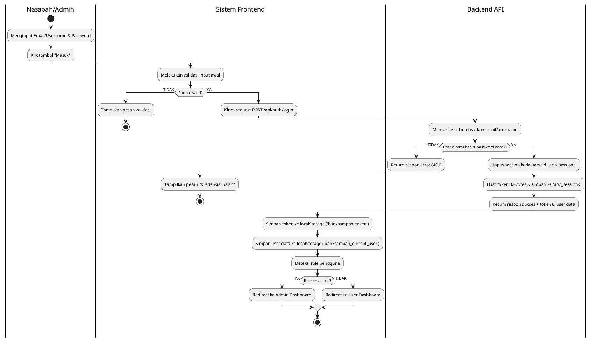

#### Deskripsi Alur
```
START
  ↓
[Nasabah/Admin menginput Email/Username & Password]
  ↓
[Klik tombol "Masuk"]
  ↓
[Frontend melakukan validasi input awal]
  ├── Kosong/Format salah? ──→ [Tampilkan pesan validasi] ──→ (Kembali ke form)
  ↓ (Terisi dengan benar)
[Frontend mengirim request POST /api/auth/login]
  ↓
[Backend memverifikasi data pengguna]
  ↓
[Query ke database untuk mencari user berdasarkan username/email]
  ↓
[Apakah kredensial terdaftar & password bcrypt cocok?]
  ├── TIDAK ──→ [Backend return respon error 401] ──→ [Tampilkan "Kredensial Salah"] ──→ (Kembali)
  ↓ YA
[Backend menghapus session kadaluarsa di 'app_sessions']
  ↓
[Backend membuat token random 32-bytes, menyimpan session baru ke 'app_sessions', & mengembalikan data User beserta token]
  ↓
[Frontend menyimpan token ke localStorage sebagai 'banksampah_token']
  ↓
[Frontend menyimpan data user ke localStorage sebagai 'banksampah_current_user']
  ↓
[Frontend mendeteksi role pengguna]
  ├── Role: admin ──→ [Redirect ke Admin Dashboard]
  └── Role: user  ──→ [Redirect ke User Dashboard]
  ↓
END
```

### AD-02 — Activity Diagram: Registrasi Nasabah
Aktor/Sistem: Calon Nasabah | Sistem Frontend | Backend API

#### Kode PlantUML
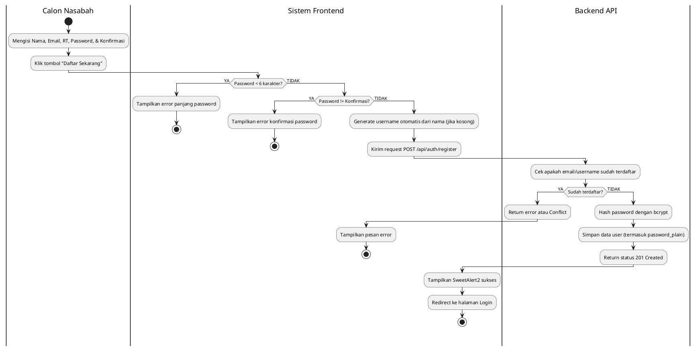

#### Deskripsi Alur
```
START
  ↓
[Calon Nasabah mengisi form: Nama, Email, RT, Password, Konfirmasi Password]
  ↓
[Klik tombol "Daftar Sekarang"]
  ↓
[Frontend memvalidasi panjang password (min. 6 karakter)]
  ├── Kurang dari 6? ──→ [Tampilkan error panjang password] ──→ (Kembali)
  ↓ YA
[Frontend memvalidasi kecocokan password & konfirmasi]
  ├── Tidak cocok? ──→ [Tampilkan error konfirmasi] ──→ (Kembali)
  ↓ YA
[Frontend men-generate username otomatis dari nama (jika kolom username tidak ditentukan)]
  ↓
[Frontend mengirim request POST /api/auth/register]
  ↓
[Backend memeriksa apakah email/username sudah terpakai di Database]
  ├── YA ──→ [Backend return error atau Conflict] ──→ [Tampilkan "Username atau email sudah digunakan"] ──→ (Kembali)
  ↓ TIDAK
[Backend melakukan hashing password (bcrypt), menyimpan sebagai 'user']
  ↓
[Backend juga menyimpan plain text password di kolom 'password_plain' untuk kebutuhan backup/pemulihan admin]
  ↓
[Backend return respon sukses 201]
  ↓
[Frontend menampilkan notifikasi SweetAlert2 sukses]
  ↓
[Redirect otomatis ke halaman Login]
  ↓
END
```

### AD-03 — Activity Diagram: Tambah Setoran (Admin)
Aktor/Sistem: Admin | Sistem Frontend | Backend API | Database

#### Kode PlantUML
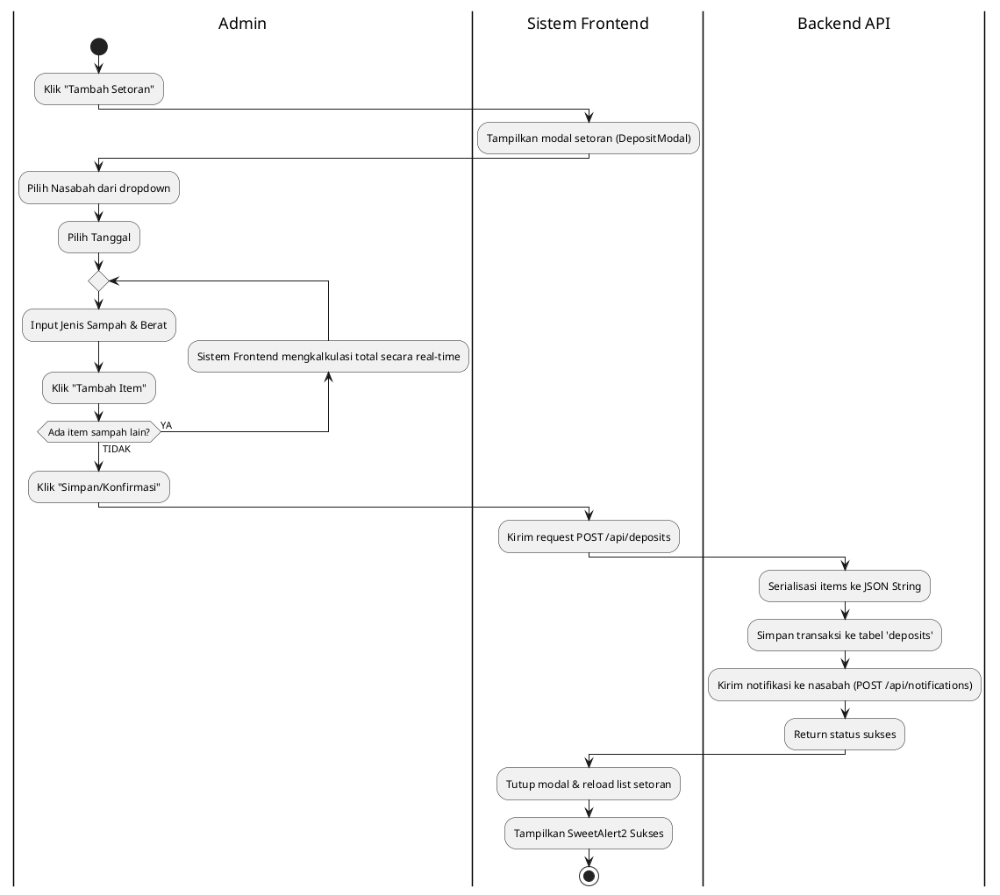

#### Deskripsi Alur
```
START
  ↓
[Admin mengklik tombol "Tambah Setoran"]
  ↓
[Sistem menampilkan modal setoran (DepositModal)]
  ↓
[Admin memilih nasabah tujuan dari list dropdown]
  ↓
[Admin memilih tanggal setoran (default: hari ini)]
  ↓
[Admin menambahkan item sampah (jenis sampah + berat)]
  ↓
[Apakah ada item sampah lain?]
  ├── YA ──→ [Admin klik "Tambah Item" & mengulangi langkah di atas]
  ↓ TIDAK
[Sistem mengkalkulasi otomatis total berat (kg/L) & total nilai (Rp) berdasarkan harga sampah aktif]
  ↓
[Admin mengklik tombol "Simpan/Konfirmasi"]
  ↓
[Frontend mengirim request POST /api/deposits ke backend]
  ↓
[Backend melakukan serialisasi array items menjadi string JSON]
  ↓
[Backend menyimpan transaksi di tabel 'deposits' dengan kolom 'items' JSON]
  ↓
[Backend mengirim notifikasi otomatis ke nasabah terkait dengan memicu POST /api/notifications]
  ↓
[Modal tertutup, reload list setoran & perbarui visual dashboard]
  ↓
[Tampilkan SweetAlert2 sukses]
  ↓
END
```

### AD-04 — Activity Diagram: Perhitungan VIKOR sebagai Penentuan Nasabah Terbaik
Aktor/Sistem: Admin/Nasabah | Frontend Core | Backend API

#### Kode PlantUML
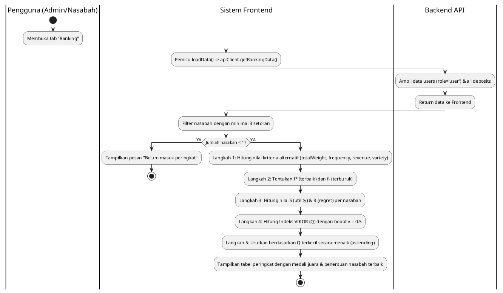

#### Deskripsi Alur
```
START
  ↓
[Pengguna (Admin/Nasabah) membuka tab atau bottom nav "Ranking"]
  ↓
[Frontend memicu fungsi `loadData()` untuk memuat data via `apiClient.getRankingData()` (GET /api/ranking)]
  ↓
[Backend mengambil data nasabah (id, name, rt) dan data semua setoran (userId, items, totalAmount, date)]
  ↓
[Sistem di frontend menyaring daftar nasabah (hanya yang memiliki minimal 3 setoran)]
  ├── Apakah jumlah nasabah memenuhi kriteria < 1? ──→ [Tampilkan pesan: "Belum masuk peringkat (min 3 setoran)"] ──→ END
  ↓ YA
[Langkah VIKOR 1: Menghitung nilai kriteria tiap alternatif nasabah (Benefit)]
  │  - Total Berat Sampah (Kriteria 1, Bobot 30%)
  │  - Frekuensi Transaksi (Kriteria 2, Bobot 30%)
  │  - Total Pendapatan (Kriteria 3, Bobot 30%)
  │  - Variasi Jenis Sampah (Kriteria 4, Bobot 10%)
  ↓
[Langkah VIKOR 2: Menentukan alternatif nilai terbaik (f*) & terburuk (f-) per kriteria]
  ↓
[Langkah VIKOR 3: Normalisasi matriks keputusan & menghitung Utility Measure (S) & Regret Measure (R)]
  ↓
[Langkah VIKOR 4: Menghitung Indeks VIKOR (Q) dengan bobot strategi v = 0.5]
  ↓
[Mengurutkan alternatif berdasarkan nilai Q terkecil secara menaik (ascending) untuk penentuan nasabah terbaik]
  ↓
[Menampilkan tabel peringkat dan penentuan nasabah terbaik dengan badge juara 🥇, 🥈, 🥉 serta highlight posisi saat ini]
  ↓
END
```

### AD-05 — Activity Diagram: Export Laporan Bulanan ke Excel
Aktor/Sistem: Admin | Frontend Core | Library SheetJS (xlsx)

#### Kode PlantUML
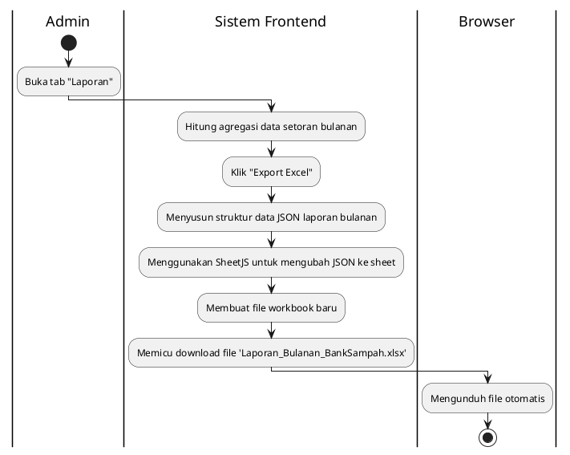

#### Deskripsi Alur
```
START
  ↓
[Admin masuk ke tab "Laporan"]
  ↓
[Sistem memuat agregasi setoran bulanan menggunakan `getMonthlyDepositStats()`]
  ↓
[Admin mengklik tombol "Export Excel"]
  ↓
[Sistem menyusun struktur data JSON laporan]
  │  - Menghitung total berat, transaksi, total nilai
  │  - Menambahkan breakdown kolom untuk 8 jenis sampah (Berat & Rp)
  ↓
[SheetJS memetakan array objek JSON menjadi Lembar Kerja Excel (Sheet)]
  ↓
[Sistem membuat file workbook baru & melampirkan lembar kerja]
  ↓
[Sistem memicu download file: `Laporan_Bulanan_BankSampah.xlsx`]
  ↓
[Browser mengunduh file secara otomatis]
  ↓
END
```

### AD-06 — Activity Diagram: Nasabah Melihat Laporan Bulanan Pribadi
Aktor/Sistem: Nasabah | Sistem Frontend | Library SheetJS (xlsx)

#### Kode PlantUML
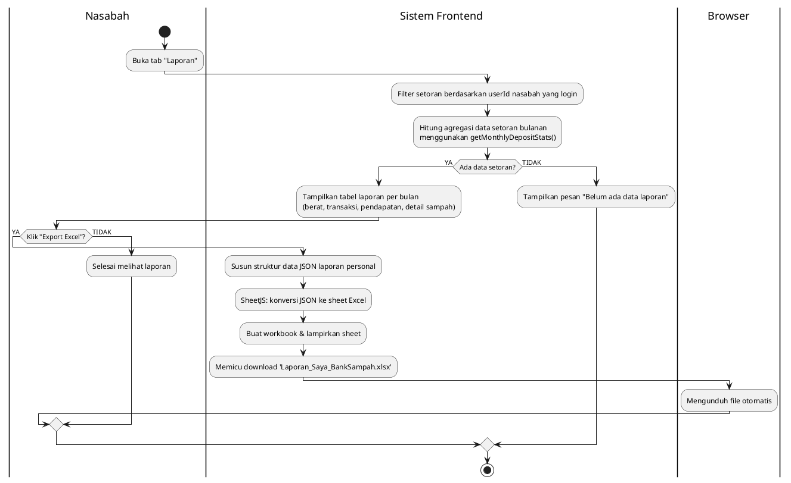

#### Deskripsi Alur
```
START
  ↓
[Nasabah membuka tab "Laporan" di panel nasabah]
  ↓
[Sistem Frontend memfilter data deposits berdasarkan userId nasabah yang sedang login]
(Data deposits sudah ada di state — tidak perlu request API tambahan)
  ↓
[Sistem menghitung agregasi setoran bulanan menggunakan `getMonthlyDepositStats()`]
  ↓
[Apakah nasabah memiliki riwayat setoran?]
  ├── TIDAK ──→ [Tampilkan pesan: "Belum ada data laporan"] ──→ END
  ↓ YA
[Sistem menampilkan tabel laporan bulanan: berat total, jumlah transaksi, total pendapatan, detail per jenis sampah]
  ↓
[Apakah nasabah mengklik "Export Excel"?]
  ├── TIDAK ──→ [Selesai melihat laporan] ──→ END
  ↓ YA
[Sistem menyusun struktur data JSON laporan personal]
  │  - Menghitung total berat, transaksi, total nilai per bulan
  │  - Menambahkan breakdown kolom per jenis sampah (Berat & Rp)
  ↓
[SheetJS memetakan array objek JSON menjadi Lembar Kerja Excel]
  ↓
[Sistem membuat workbook baru & melampirkan sheet]
  ↓
[Sistem memicu download file: `Laporan_Saya_BankSampah.xlsx`]
  ↓
[Browser mengunduh file secara otomatis]
  ↓
END
```

---

## 📌 C. SEQUENCE DIAGRAM

### SD-01 — Sequence Diagram: Login (Autentikasi)
Menggambarkan alur masuk pengguna (Admin/Nasabah) ke dalam sistem.

#### Kode PlantUML
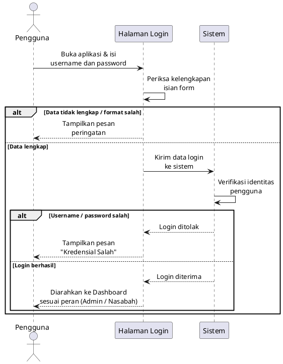

#### Alur Penjelasan (Indonesian)
1. **Pengguna** memasukkan username/email dan password pada **Halaman Login**, kemudian mengklik tombol "Masuk".
2. **Halaman Login** melakukan validasi awal format input secara lokal.
3. **Halaman Login** mengirimkan data ke **Server API** melalui request `POST /api/auth/login`.
4. **Server API** melakukan query pencarian ke **Database** berdasarkan data username/email yang dikirimkan.
5. **Database** mengembalikan data baris pengguna (termasuk hash password bcrypt).
6. **Server API** membandingkan kecocokan password yang diinput dengan password terenkripsi dari database:
   - **Jika Kredensial Valid**: **Server API** menyimpan sesi login baru ke tabel `app_sessions` di **Database**, menerima konfirmasi sukses, lalu mengirimkan respon `200 OK` berisi token beserta data profil user ke **Halaman Login**. **Halaman Login** menyimpan token tersebut di `localStorage` dan mengarahkan pengguna ke Dashboard yang sesuai dengan perannya (role).
   - **Jika Kredensial Tidak Valid**: **Server API** mengirimkan respon error `401 Unauthorized` ke **Halaman Login**, dan sistem menampilkan pesan kesalahan login kepada **Pengguna**.

---

### SD-02 — Sequence Diagram: Register (Pendaftaran)
Menggambarkan alur pendaftaran akun nasabah baru.

#### Kode PlantUML
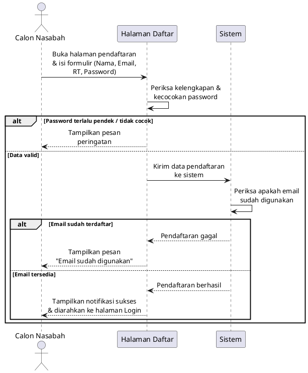

#### Alur Penjelasan (Indonesian)
1. **Calon Nasabah** mengisi formulir registrasi (nama, email, nomor RT, password, konfirmasi password) lalu mengklik "Daftar".
2. **Halaman Register** melakukan pengecekan panjang password (minimal 6 karakter) dan kecocokannya dengan konfirmasi password.
3. **Halaman Register** mengirimkan request pendaftaran ke **Server API** melalui request `POST /api/auth/register`.
4. **Server API** memeriksa ke **Database** apakah email atau username yang diinput sudah digunakan.
5. **Database** memberikan status ketersediaan kembali ke **Server API**.
6. **Server API** memproses pendaftaran berdasarkan status ketersediaan:
   - **Jika Belum Terdaftar**: **Server API** melakukan enkripsi password menggunakan bcrypt, lalu menyimpan data nasabah baru ke tabel `users` di **Database**. Setelah sukses, **Server API** mengembalikan respon `201 Created` ke **Halaman Register**. Sistem kemudian menampilkan notifikasi berhasil dan mengarahkan nasabah ke halaman login.
   - **Jika Sudah Terdaftar**: **Server API** mengirimkan respon error `409 Conflict` ke **Halaman Register**, yang kemudian memicu pesan error bahwa email/username sudah terpakai.

---

### SD-03 — Sequence Diagram: Kelola Setoran
Menggambarkan alur perekaman setoran sampah baru oleh Admin.

#### Kode PlantUML
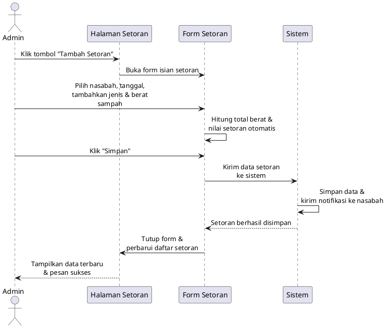

#### Alur Penjelasan (Indonesian)
1. **Admin** mengklik tombol "Tambah Setoran" pada **Halaman Setoran**, sehingga memicu munculnya **Modal Setoran**.
2. **Admin** memilih nasabah, tanggal, serta menginput daftar jenis sampah dan berat setoran sebelum mengklik tombol "Simpan".
3. **Modal Setoran** melakukan validasi input formulir lalu mengirim request `POST /api/deposits` ke **Server API**.
4. **Server API** mengonversi array item sampah menjadi format JSON string, lalu menyimpannya ke tabel `deposits` di **Database**.
5. Setelah setoran tersimpan, **Server API** membuat pesan notifikasi secara otomatis dan menyimpannya ke tabel `notifications` di **Database** agar nasabah terkait mendapatkan pemberitahuan setoran.
6. **Server API** mengembalikan respon sukses ke **Modal Setoran**, yang kemudian menutup modal dan memicu **Halaman Setoran** untuk memuat ulang data.
7. **Halaman Setoran** mengirim request `GET /api/deposits` ke **Server API** untuk mengambil data setoran terbaru dari **Database**.
8. **Halaman Setoran** memperbarui tabel setoran pada layar dan menampilkan pesan notifikasi sukses kepada **Admin**.

---

### SD-04 — Sequence Diagram: Kelola Data Nasabah
Menggambarkan alur administrasi data profil nasabah oleh Admin.

#### Kode PlantUML
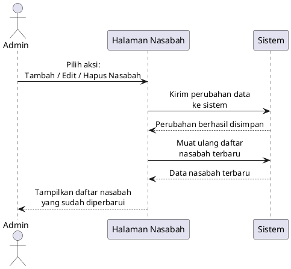

#### Alur Penjelasan (Indonesian)
1. **Admin** melakukan operasi manajemen data nasabah (seperti menambah data nasabah baru, mengedit data nasabah, atau menghapus nasabah) di **Halaman Nasabah**.
2. **Halaman Nasabah** mengirimkan request HTTP yang sesuai (`POST`, `PUT`, atau `DELETE`) ke **Server API** dengan parameter data yang relevan.
3. **Server API** mengeksekusi query database untuk menambah, mengubah, atau menghapus record data nasabah di tabel `users` **Database**.
4. **Database** memberikan status konfirmasi bahwa operasi data berhasil diselesaikan.
5. **Server API** mengirimkan respon sukses ke **Halaman Nasabah**.
6. **Halaman Nasabah** langsung meminta daftar data nasabah terupdate via request `GET /api/users` ke **Server API** yang ditarik dari **Database**.
7. **Halaman Nasabah** memperbarui tampilan tabel nasabah agar mencerminkan data terbaru, serta menampilkan pesan pemberitahuan sukses kepada **Admin**.

---

### SD-05 — Sequence Diagram: Kelola Notifikasi
Menggambarkan alur nasabah dalam membaca atau menghapus notifikasi mereka.

#### Kode PlantUML
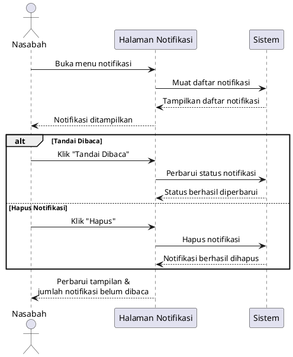

#### Alur Penjelasan (Indonesian)
1. **Nasabah** membuka menu notifikasi dan memilih opsi untuk menandai notifikasi telah dibaca atau menghapus pesan notifikasi tertentu.
2. **Halaman Notifikasi** mengirimkan request HTTP `PUT` (untuk mengubah status `is_read = 1`) atau `DELETE` (untuk menghapus baris) ke **Server API**.
3. **Server API** memproses perubahan tersebut di tabel `notifications` milik **Database**.
4. **Database** mengembalikan hasil konfirmasi keberhasilan update/delete.
5. **Server API** mengirimkan respon sukses `200 OK` ke **Halaman Notifikasi**.
6. **Halaman Notifikasi** meminta kembali daftar notifikasi terupdate dari **Server API** melalui request `GET /api/notifications/:userId`.
7. **Database** mengembalikan daftar notifikasi terbaru.
8. **Halaman Notifikasi** memperbarui tampilan notifikasi di layar, menghilangkan tanda tebal/belum dibaca, serta memperbarui badge jumlah notifikasi yang tersisa.

---

### SD-06 — Sequence Diagram: Penentuan Nasabah Terbaik (Metode VIKOR)
Menggambarkan proses penghitungan dan perankingan alternatif nasabah terbaik menggunakan metode VIKOR.

#### Kode PlantUML
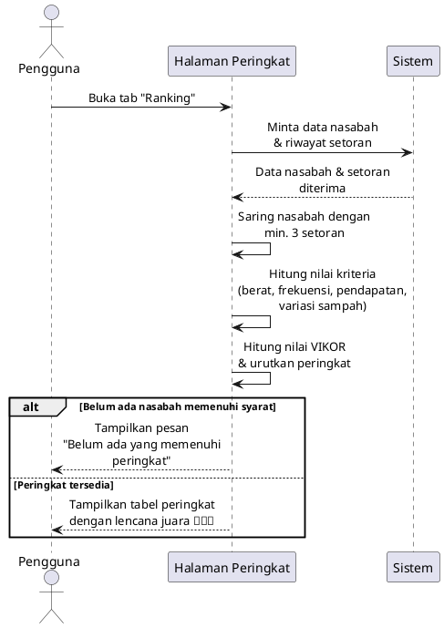

#### Alur Penjelasan (Indonesian)
1. **Pengguna** (Admin/Nasabah) membuka tab atau menu "Ranking" untuk melihat urutan nasabah.
2. **Halaman Peringkat** melakukan pemanggilan fungsi `loadData()` untuk menarik data pendukung ranking dari **Server API** melalui request `GET /api/ranking`.
3. **Server API** melakukan query ke **Database** untuk menarik data nasabah (`users`) serta semua catatan transaksi setoran (`deposits`).
4. **Database** mengembalikan kumpulan data nasabah dan catatan transaksi setoran tersebut.
5. **Server API** meneruskan data mentah tersebut dalam format JSON ke **Halaman Peringkat**.
6. **Halaman Peringkat** (sisi client) melakukan kalkulasi perankingan secara langsung menggunakan rumus metode VIKOR:
   - Menyaring data nasabah yang memiliki setoran minimal 3 kali.
   - Menghitung nilai setiap kriteria benefit: Total Berat Sampah (30%), Frekuensi Transaksi (30%), Total Pendapatan (30%), dan Variasi Sampah (10%).
   - Mencari nilai alternatif terbaik ($f^*$) dan terburuk ($f^-$) dari setiap kriteria.
   - Menghitung nilai *Utility Measure* ($S$) dan *Regret Measure* ($R$) untuk setiap nasabah.
   - Menghitung Indeks VIKOR ($Q$) dengan bobot keputusan $v = 0.5$.
   - Mengurutkan nasabah berdasarkan indeks $Q$ dari nilai terkecil hingga terbesar (secara ascending).
7. **Halaman Peringkat** menampilkan hasil tabel peringkat final, menyorot baris nasabah dengan nilai $Q$ terkecil sebagai Nasabah Terbaik dengan lencana juara.

---

### SD-07 — Sequence Diagram: Laporan
Menggambarkan alur pengumpulan laporan setoran bulanan dan ekspor ke lembar kerja Excel.

#### Kode PlantUML
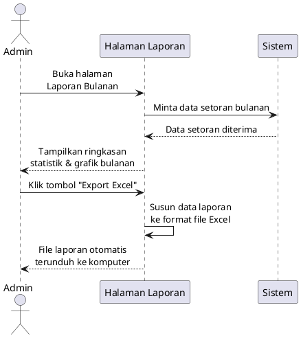

#### Alur Penjelasan (Indonesian)
1. **Admin** membuka Halaman Laporan Bulanan pada menu dasbor admin.
2. **Halaman Laporan** secara otomatis meminta statistik transaksi dengan mengirimkan request `GET /api/deposits` ke **Server API**.
3. **Server API** melakukan query pemanggilan data setoran teragregasi bulanan dari tabel `deposits` di **Database**.
4. **Database** mengembalikan data hasil agregasi transaksi setoran.
5. **Server API** mengirimkan data tersebut dalam bentuk data statistik bulanan ke **Halaman Laporan**.
6. **Halaman Laporan** merender data ringkasan bulanan beserta diagram grafiknya di layar.
7. **Admin** mengklik tombol "Export Excel" untuk mengunduh laporan fisik.
8. **Halaman Laporan** menyusun dataset laporan ke format JSON terstruktur, lalu menggunakan library SheetJS untuk mengubah data tersebut menjadi lembar kerja (worksheet) dan buku kerja (workbook) Excel.
9. **Halaman Laporan** memicu unduhan otomatis pada browser **Admin**, mengunduh file `Laporan_Bulanan_BankSampah.xlsx`.

---

### SD-08 — Sequence Diagram: Lupa Password
Menggambarkan alur nasabah yang lupa password dan ingin mereset akun melalui email.

#### Kode PlantUML
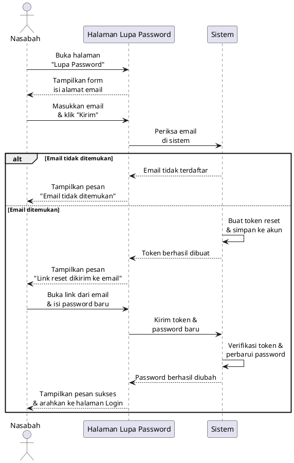

#### Alur Penjelasan (Indonesian)
1. **Nasabah** membuka halaman "Lupa Password" dan mengisi alamat email yang terdaftar.
2. **Sistem** memeriksa apakah email tersebut terdaftar di database.
3. Jika email **tidak ditemukan**, sistem menampilkan pesan peringatan.
4. Jika email **ditemukan**, sistem membuat token reset unik dan mengirimkan link reset ke email nasabah.
5. **Nasabah** membuka link dari email, lalu mengisi password baru.
6. **Sistem** memverifikasi token dan memperbarui password nasabah.
7. **Sistem** menampilkan pesan sukses dan mengarahkan nasabah kembali ke halaman Login.

---

### SD-09 — Sequence Diagram: Dashboard Admin
Menggambarkan alur Admin membuka dan melihat ringkasan data di halaman Dashboard.

#### Kode PlantUML
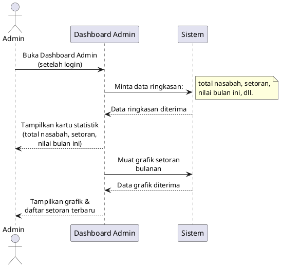

#### Alur Penjelasan (Indonesian)
1. **Admin** berhasil login dan secara otomatis diarahkan ke halaman **Dashboard Admin**.
2. **Dashboard Admin** meminta data ringkasan statistik kepada **Sistem** (total nasabah, jumlah setoran, total nilai bulan ini).
3. **Sistem** mengembalikan data tersebut dan **Dashboard** menampilkannya sebagai kartu statistik.
4. **Dashboard Admin** kemudian memuat data grafik setoran bulanan dan daftar transaksi terbaru dari **Sistem**.
5. **Admin** dapat melihat seluruh ringkasan aktivitas bank sampah dalam satu tampilan.

---

### SD-10 — Sequence Diagram: Dashboard Nasabah
Menggambarkan alur Nasabah membuka halaman Dashboard untuk melihat saldo dan informasi akun.

#### Kode PlantUML
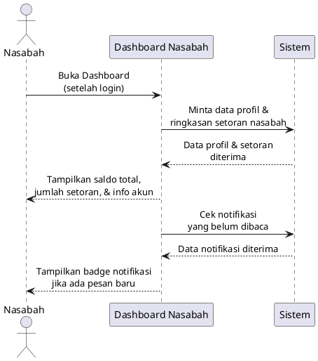

#### Alur Penjelasan (Indonesian)
1. **Nasabah** berhasil login dan diarahkan ke halaman **Dashboard Nasabah**.
2. **Dashboard** meminta data profil dan ringkasan setoran milik nasabah yang sedang login.
3. **Sistem** mengembalikan data tersebut — Dashboard menampilkan saldo total, jumlah setoran, dan informasi akun.
4. **Dashboard** sekaligus mengecek apakah ada notifikasi yang belum dibaca.
5. Jika ada notifikasi baru, **Dashboard** menampilkan badge penanda pada ikon notifikasi.

---

### SD-11 — Sequence Diagram: Riwayat Setoran Nasabah
Menggambarkan alur Nasabah melihat riwayat setoran sampah miliknya.

#### Kode PlantUML
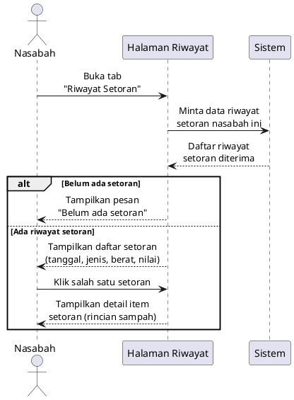

#### Alur Penjelasan (Indonesian)
1. **Nasabah** membuka tab "Riwayat Setoran" pada menu aplikasi.
2. **Halaman Riwayat** meminta data seluruh setoran milik nasabah yang sedang login dari **Sistem**.
3. Jika belum ada setoran, halaman menampilkan pesan informatif.
4. Jika ada riwayat, **Halaman Riwayat** menampilkan daftar setoran beserta tanggal, jenis sampah, total berat, dan nilai rupiah.
5. **Nasabah** dapat mengklik salah satu setoran untuk melihat detail rincian item sampah yang disetorkan.

---

### SD-12 — Sequence Diagram: Logout
Menggambarkan alur pengguna keluar dari sesi aplikasi.

#### Kode PlantUML
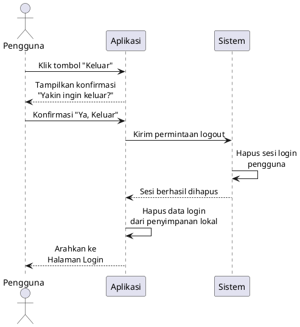

#### Alur Penjelasan (Indonesian)
1. **Pengguna** mengklik tombol "Keluar" pada menu aplikasi.
2. **Aplikasi** menampilkan dialog konfirmasi untuk mencegah logout tidak disengaja.
3. Setelah pengguna mengkonfirmasi, **Aplikasi** mengirimkan permintaan logout ke **Sistem**.
4. **Sistem** menghapus sesi login aktif pengguna dari server.
5. **Aplikasi** menghapus data login (token & data pengguna) yang tersimpan di perangkat.
6. **Pengguna** diarahkan kembali ke halaman Login.

---

### SD-13 — Sequence Diagram: Nasabah Melihat Laporan Bulanan Pribadi
Menggambarkan alur nasabah membuka tab laporan dan mengekspor data setoran bulanan milik pribadinya.

#### Kode PlantUML
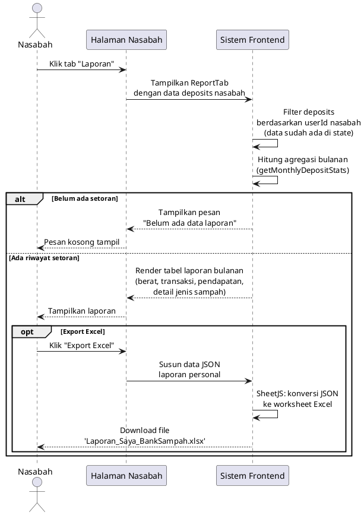

#### Alur Penjelasan (Indonesian)
1. **Nasabah** mengklik tab "Laporan" pada menu navigasi panel nasabah.
2. **Halaman Nasabah** menampilkan komponen `ReportTab` dengan data deposits yang sudah tersedia di state aplikasi.
3. **Sistem Frontend** memfilter data deposits berdasarkan `userId` nasabah yang sedang login — tidak perlu request API baru karena data sudah ada.
4. **Sistem Frontend** menghitung agregasi data setoran bulanan menggunakan fungsi `getMonthlyDepositStats()`.
5. Jika **belum ada setoran**, halaman menampilkan pesan informatif "Belum ada data laporan".
6. Jika **ada riwayat setoran**, tabel laporan bulanan ditampilkan berisi: total berat (kg), jumlah transaksi, total pendapatan (Rp), dan detail per jenis sampah.
7. Opsional — jika **Nasabah** mengklik tombol "Export Excel", sistem menyusun data JSON laporan, lalu menggunakan library SheetJS untuk mengonversinya menjadi file Excel, dan file `Laporan_Saya_BankSampah.xlsx` langsung diunduh di browser.

---

## 📌 D. CLASS DIAGRAM

### Visualisasi Class Diagram (Mermaid)
```mermaid
classDiagram
    direction LR
    class User {
        +varchar(36) id
        +varchar(100) username
        +varchar(255) name
        +varchar(255) email
        +varchar(50) rt
        +varchar(255) password
        +varchar(255) password_plain
        +enum('user','admin') role
        +tinyint is_verified
        +varchar(255) verification_token
        +varchar(255) reset_password_token
        +datetime reset_password_expires
        +timestamp created_at
        +login(username, password) Object
        +register(userData) Object
        +forgotPassword(email) Object
        +resetPassword(token, password) Object
        +verifyEmail(token) Object
        +getUsers() Array
        +updateUser(id, userData) Object
        +deleteUser(id) Object
    }

    class AppSession {
        +varchar(255) token
        +varchar(36) user_id
        +datetime expires_at
        +timestamp created_at
        +createSession(userId, token) Object
        +deleteExpiredSessions() Boolean
    }

    class Deposit {
        +varchar(36) id
        +varchar(36) user_id
        +json items
        +decimal(15,2) total_amount
        +date date
        +varchar(50) status
        +varchar(50) priority
        +timestamp created_at
        +getDeposits() Array
        +getDepositsByUser(userId) Array
        +addDeposit(depositData) Object
        +updateDeposit(id, depositData) Object
        +deleteDeposit(id) Object
    }

    class Notification {
        +varchar(36) id
        +varchar(36) user_id
        +varchar(255) title
        +text message
        +varchar(50) type
        +tinyint(1) is_read
        +timestamp created_at
        +getNotifications(userId) Array
        +addNotification(notifData) Object
        +markAsRead(id) Object
        +clearNotifications(userId) Object
    }

    class WastePrice {
        +int id
        +varchar(255) name
        +varchar(50) unit
        +decimal(15,2) price_per_unit
        +varchar(100) category
        +timestamp created_at
        +getWastePrices() Array
        +updateWastePrices(prices) Object
    }

    class VIKORAlgorithm {
        +WASTE_PRICES Object
        +WASTE_TYPES Object
        +calculateVikorRanking(deposits, users, v) Array
        +calculateUserBalance(userDeposits) Number
        +getMonthlyDepositStats(deposits) Array
    }

    class ApiClient {
        +login(username, password) Object
        +register(userData) Object
        +forgotPassword(email) Object
        +resetPassword(token, password) Object
        +verifyEmail(token) Object
        +getUsers() Array
        +updateUser(id, userData) Object
        +deleteUser(id) Object
        +getDeposits() Array
        +getDepositsByUser(userId) Array
        +getRankingData() Object
        +addDeposit(depositData) Object
        +updateDeposit(id, depositData) Object
        +deleteDeposit(id) Object
        +getWastePrices() Array
        +updateWastePrices(prices) Object
        +getNotifications(userId) Array
        +addNotification(notifData) Object
        +markAsRead(id) Object
        +clearNotifications(userId) Object
    }

    User "1" --> "0..*" AppSession : memiliki
    User "1" --> "0..*" Deposit : melakukan setoran
    User "1" --> "0..*" Notification : menerima
    ApiClient ..> User : meminta data
    ApiClient ..> Deposit : meminta data
    ApiClient ..> WastePrice : meminta data
    ApiClient ..> Notification : meminta data
    ApiClient ..> VIKORAlgorithm : menggunakan
```

### Penjelasan Entitas Kelas

* **User**: Merepresentasikan data pengguna sistem, baik **Admin** maupun **Nasabah**, lengkap dengan profil dan perannya.
* **AppSession**: Menyimpan data token sesi aktif dari pengguna yang berhasil masuk (login) untuk mengamankan otorisasi API request.
* **Deposit**: Mencatat transaksi setoran sampah oleh nasabah, termasuk daftar item sampah (jenis & berat) dan total nilai rupiah yang diperoleh.
* **Notification**: Menyimpan riwayat notifikasi atau pesan yang dikirimkan kepada nasabah terkait aktivitas setorannya.
* **WastePrice**: Menyimpan master data daftar jenis sampah beserta satuan unit dan harga per unit yang berlaku.
* **VIKORAlgorithm**: Kelas utilitas logika bisnis untuk menghitung perankingan nasabah terbaik dengan metode VIKOR.
* **ApiClient**: Kelas HTTP client frontend untuk berinteraksi dengan API Express Backend.

---

## 📌 E. COMMUNICATION DIAGRAM

### CM-01 — Communication Diagram: Register (Pendaftaran Nasabah Baru)
Menggambarkan kolaborasi antar objek dalam proses pendaftaran akun nasabah baru:

#### Kode PlantUML
```plantuml
@startuml
left to right direction
object "Calon Nasabah" as calon
object "Halaman Register" as view
object "Sistem" as sistem

calon --> view : 1: Membuka halaman pendaftaran
view --> calon : 2: Menampilkan form pendaftaran
calon --> view : 3: Mengisi data diri dan klik "Daftar"
view --> sistem : 4: Memproses pendaftaran akun
sistem --> view : 5: Pendaftaran berhasil
view --> calon : 6: Menampilkan notifikasi sukses dan mengarahkan ke halaman Login
@enduml
```

#### Alur Kolaborasi Objek
```
         1: Membuka halaman pendaftaran
  [ Calon Nasabah ] ─────────────────────────────> [ Halaman Register ]
         ▲                                                  │
         │  2: Menampilkan form pendaftaran                 │
         │◄─────────────────────────────────────────────── │
         │                                                  │
         │  3: Mengisi data diri & klik "Daftar"            │
         │─────────────────────────────────────────────────>│
         │                                                  │ 4: Memproses pendaftaran
         │                                                  ▼
         │                                            [ Sistem ]
         │                                                  │
         │                              5: Pendaftaran OK   │
         │◄─────────────────────────────────────────────── ─┘
         │  6: Notifikasi sukses & arahkan ke Login
```

---

### CM-02 — Communication Diagram: Kelola Data Nasabah (Admin)
Menggambarkan kolaborasi antar objek saat Admin mengelola data nasabah (Tambah / Edit / Hapus):

#### Kode PlantUML
```plantuml
@startuml
left to right direction
object "Admin" as admin
object "Halaman Kelola Nasabah" as view
object "Form Data Nasabah" as form
object "Sistem" as sistem

admin --> view : 1: Membuka halaman Kelola Nasabah
view --> admin : 2: Menampilkan daftar nasabah
admin --> view : 3: Memilih aksi (Tambah / Edit / Hapus)
view --> form : 4: Menampilkan form data nasabah
admin --> form : 5: Mengisi atau mengubah data nasabah
form --> sistem : 6: Menyimpan perubahan data
sistem --> view : 7: Data berhasil disimpan
view --> admin : 8: Menampilkan daftar nasabah terbaru dan notifikasi sukses
@enduml
```

#### Alur Kolaborasi Objek
```
         1: Membuka halaman Kelola Nasabah
  [ Admin ] ──────────────────────────────────────────> [ Halaman Kelola Nasabah ]
     ▲                                                           │
     │  2: Menampilkan daftar nasabah                            │
     │◄────────────────────────────────────────────────────────  │
     │                                                           │
     │  3: Memilih aksi (Tambah / Edit / Hapus)                  │
     │──────────────────────────────────────────────────────────>│
     │                                                           │ 4: Menampilkan form
     │                                                           ▼
     │  5: Mengisi / mengubah data               [ Form Data Nasabah ]
     │──────────────────────────────────────────────────────────>    │
     │                                                               │ 6: Menyimpan perubahan
     │                                                               ▼
     │                                                         [ Sistem ]
     │                                                               │
     │                              7: Data berhasil disimpan        │
     │◄──────────────────────────────────────────────────────────────┘
     │  8: Daftar nasabah terbaru & notifikasi sukses
```

---


### CM-03 — Communication Diagram: Lupa Password (Reset Password)
Menggambarkan kolaborasi antar objek dalam alur pemulihan akses ketika nasabah lupa password melalui mekanisme reset token:

#### Kode PlantUML
```plantuml
@startuml
left to right direction
object "Nasabah : Actor" as nasabah
object "HalamanLupaPassword : View" as view
object "Express Backend : API" as backend
object "MySQL Database" as db

nasabah --> view : 1: Klik "Lupa Password?" & input email terdaftar
view --> view : 2: Validasi format email
view --> backend : 3: POST /api/auth/forgot-password { email }
backend --> db : 4: SELECT user WHERE email = :email
backend --> backend : 5: Generate reset_token (32-bytes random)
backend --> db : 6: UPDATE users SET reset_password_token & reset_password_expires
backend --> view : 7: Respon 200 OK (link reset dikirim via email)
view --> nasabah : 8: Tampilkan pesan "Link reset dikirim ke email Anda"
nasabah --> view : 9: Klik link dari email & input password baru
view --> backend : 10: POST /api/auth/reset-password { token, newPassword }
backend --> db : 11: SELECT & verifikasi token & cek expiry
backend --> backend : 12: Hash password baru dengan bcrypt
backend --> db : 13: UPDATE password & password_plain, hapus token
backend --> view : 14: Respon 200 OK (Password berhasil direset)
view --> nasabah : 15: Tampilkan SweetAlert sukses & redirect ke Halaman Login
@enduml
```

#### Alur Kolaborasi Objek (Versi Ringkas — Alur Penggunaan)
```
         1: Membuka halaman Lupa Password & memasukkan email
  [ Nasabah ] ─────────────────────────────────────────────> [ Halaman Lupa Password ]
       ▲                                                              │
       │  2: Menampilkan form input email                             │
       │◄───────────────────────────────────────────────────────────  │
       │                                                              │
       │  3: Mengisi email & klik "Kirim Link Reset"                  │
       │─────────────────────────────────────────────────────────────>│
       │                                                              │ 4: Memproses permintaan reset
       │                                                              ▼
       │                                                        [ Sistem ]
       │                                                              │
       │  5: Pemberitahuan "Link reset dikirim ke email"              │
       │◄─────────────────────────────────────────────────────────────┘
       │
       │  6: Membuka link dari email & mengisi password baru
       │─────────────────────────────────────────────────────────────> [ Halaman Reset Password ]
       │                                                              │
       │  7: Mengisi password baru & klik "Reset Password"            │
       │─────────────────────────────────────────────────────────────>│
       │                                                              │ 8: Memperbarui password
       │                                                              ▼
       │                                                        [ Sistem ]
       │
       │  9: Notifikasi "Password berhasil diubah" & arahkan ke Login
       └◄─────────────────────────────────────────────────────────────
```

---

### CM-04 — Communication Diagram: Dashboard Admin
Menggambarkan kolaborasi antar objek saat Admin membuka Dashboard dan melihat ringkasan data operasional sistem:

#### Kode PlantUML
```plantuml
@startuml
left to right direction
object "Admin" as admin
object "Dashboard Admin" as view
object "Sistem" as sistem

admin --> view : 1: Masuk ke sistem sebagai Admin
view --> sistem : 2: Memuat data nasabah, setoran, dan harga sampah
sistem --> view : 3: Data berhasil dimuat
view --> view : 4: Menghitung statistik dan peringkat nasabah
view --> admin : 5: Menampilkan ringkasan: jumlah nasabah, total setoran, grafik bulanan, dan peringkat
@enduml
```

#### Alur Kolaborasi Objek
```
         1: Masuk ke sistem sebagai Admin
  [ Admin ] ──────────────────────────────────> [ Dashboard Admin ]
      ▲                                                  │
      │                                                  │ 2: Memuat data nasabah,
      │                                                  │    setoran & harga sampah
      │                                                  ▼
      │                                            [ Sistem ]
      │                                                  │
      │                   3: Data berhasil dimuat        │
      │◄─────────────────────────────────────────────────┘
      │                       (4: Menghitung statistik & peringkat)
      │
      │  5: Menampilkan ringkasan statistik, grafik, dan peringkat
      └◄────────────────────────────────────────────────
```

---


## 📌 F. ERD (Entity Relationship Diagram)

### Visualisasi ERD (Mermaid)
```mermaid
erDiagram
    users ||--o{ app_sessions : "has"
    users ||--o{ deposits : "performs"
    users ||--o{ notifications : "receives"
    
    users {
        varchar_36 id PK
        varchar_100 username UK
        varchar_255 name
        varchar_255 email UK
        varchar_50 rt
        varchar_255 password
        varchar_255 password_plain
        enum_role role
        varchar_255 reset_password_token
        datetime reset_password_expires
        timestamp created_at
    }

    app_sessions {
        varchar_255 token PK
        varchar_36 user_id FK
        datetime expires_at
        timestamp created_at
    }

    deposits {
        varchar_36 id PK
        varchar_36 user_id FK
        json items
        decimal_15_2 total_amount
        date date
        varchar_50 status
        varchar_50 priority
        timestamp created_at
    }

    notifications {
        varchar_36 id PK
        varchar_36 user_id FK
        varchar_255 title
        text message
        varchar_50 type
        tinyint_1 is_read
        timestamp created_at
    }

    waste_prices {
        int id PK
        varchar_255 name
        varchar_50 unit
        decimal_15_2 price_per_unit
        varchar_100 category
        timestamp created_at
    }
```

### Skema dan Kardinalitas Relasi Database

```
===========================================================
                      DESIGN SKEMA DATA
===========================================================

  [users] 
  -------
  PK  id VARCHAR(36)
      username VARCHAR(100) UNIQUE
      name VARCHAR(255)
      email VARCHAR(255) UNIQUE
      rt VARCHAR(50)
      password VARCHAR(255)
      password_plain VARCHAR(255)  <-- (Kolom Backup Pemulihan Admin)
      role ENUM('user', 'admin')
      reset_password_token VARCHAR(255)
      reset_password_expires DATETIME
      created_at TIMESTAMP
      
       │
       ├─ 1 : N ────────────────────────┐
       │                                │
       ├─ 1 : N ──────────┐             │
       │                  │             │
       ├─ 1 : N ──┐       │             │
       │          │       │             │
       ▼          ▼       ▼             ▼
  [app_sessions] [deposits] [notifications]
  -------------- ---------- ---------------
  PK token       PK id      PK id
  FK user_id     FK user_id FK user_id
  
  [app_sessions]
  --------------
  PK  token VARCHAR(255)
  FK  user_id VARCHAR(36) (Ref: users.id)
      expires_at DATETIME
      created_at TIMESTAMP

  [deposits]
  ----------
  PK  id VARCHAR(36)
  FK  user_id VARCHAR(36) (Ref: users.id)
      items JSON  (Menyimpan array detail: [{type, weight, price}, ...])
      total_amount DECIMAL(15,2)
      date DATE
      status VARCHAR(50)
      priority VARCHAR(50)
      created_at TIMESTAMP

  [notifications]
  ---------------
  PK  id VARCHAR(36)
  FK  user_id VARCHAR(36) (Ref: users.id)
      title VARCHAR(255)
      message TEXT
      type VARCHAR(50)
      is_read TINYINT(1)
      created_at TIMESTAMP

  [waste_prices] (Standalone Master Data)
  --------------
  PK  id INT AUTO_INCREMENT
      name VARCHAR(255)
      unit VARCHAR(50)
      price_per_unit DECIMAL(15,2)
      category VARCHAR(100)
      created_at TIMESTAMP
```

---

## 📌 G. DEPLOYMENT DIAGRAM

Menggambarkan alokasi fisik dari komponen software pada node perangkat keras:

### Visualisasi Deployment Diagram (Mermaid Flowchart)
```mermaid
flowchart TD
    subgraph ClientNode ["Node: PC / Smartphone Client"]
        Browser["Component: Web Browser"]
        SPA["Artifact: React Frontend (Vite SPA)"]
        Browser --- SPA
    end

    subgraph ServerNode ["Node: Server / Host"]
        subgraph NodeServer ["Component: Node.js Run-Time"]
            API["Artifact: Express.js API"]
        end
        subgraph DatabaseServer ["Component: Database Server"]
            MySQL["Database: MySQL Server"]
        end
    end

    SPA -- "HTTPS / JSON (Port 5000 / 443)" --> API
    API -- "TCP/IP Connection (Port 3306)" --> MySQL
```

### Topologi Arsitektur Fisik
```
┌────────────────────────────────────────────────────────┐
│               Node: PC / Smartphone Client             │
│   ┌────────────────────────────────────────────────┐   │
│   │           Component: Web Browser               │   │
│   │ ┌────────────────────────────────────────────┐ │   │
│   │ │        Artifact: React Frontend SPA        │ │   │
│   │ └────────────────────────────────────────────┘ │   │
│   └────────────────────────────────────────────────┘   │
└──────────────────────────┬─────────────────────────────┘
                           │ HTTPS Protocol (Port 443/5000)
                           ▼
┌────────────────────────────────────────────────────────┐
│                   Node: Server / Host                  │
│   ┌────────────────────────────────────────────────┐   │
│   │           Component: Node.js Server            │   │
│   │ ┌────────────────────────────────────────────┐ │   │
│   │ │           Artifact: Express.js API         │ │   │
│   │ └────────────────────────────────────────────┘ │   │
│   └──────────────────────┬─────────────────────────┘   │
│                          │ TCP/IP Connection (Port 3306)
│                          ▼
│   ┌────────────────────────────────────────────────┐   │
│   │           Component: Database Server           │   │
│   │ ┌────────────────────────────────────────────┐ │   │
│   │ │           Database: MySQL Server           │ │   │
│   │ └────────────────────────────────────────────┘ │   │
│   └────────────────────────────────────────────────┘   │
└────────────────────────────────────────────────────────┘
```

---

## 📌 H. RANCANGAN ANTARMUKA (USER INTERFACE DESIGN)

Rancangan antarmuka ini dirancang menggunakan pendekatan *Responsive Web Design* yang optimal untuk diakses baik melalui perangkat desktop (untuk Admin) maupun mobile smartphone (untuk Nasabah).

### 1. KELOMPOK ANTARMUKA AUTENTIKASI (SHARED)

#### UI-01 — Halaman Login (Masuk Sistem)
* **Tujuan**: Memverifikasi kredensial pengguna (Admin & Nasabah) untuk masuk ke sistem.
* **Komponen Utama**:
  * Input field untuk Username/Email.
  * Input field untuk Password (dengan ikon toggle show/hide password).
  * Tombol "Masuk".
  * Link "Lupa Password?" dan "Daftar Akun Baru" (untuk nasabah).
* **Wireframe**:
```
┌────────────────────────────────────────────────────────┐
│                      BANK SAMPAH                       │
│                   BAKTI ALAM DIGITAL                   │
│                                                        │
│               [ Username / Email             ]         │
│               [ Password                 [O] ]         │
│                                                        │
│               ┌──────────────────────────────┐         │
│               │            MASUK             │         │
│               └──────────────────────────────┘         │
│                                                        │
│     Lupa Password?                  Daftar Akun Baru   │
└────────────────────────────────────────────────────────┘
```

#### UI-02 — Halaman Registrasi Nasabah
* **Tujuan**: Tempat calon nasabah membuat akun baru secara mandiri.
* **Komponen Utama**:
  * Input field: Nama Lengkap, Email, No RT (dropdown/input), Password, Konfirmasi Password.
  * Tombol "Daftar Sekarang".
  * Link "Sudah punya akun? Login".
* **Wireframe**:
```
┌────────────────────────────────────────────────────────┐
│                   REGISTRASI NASABAH                   │
│                                                        │
│               [ Nama Lengkap                 ]         │
│               [ Alamat Email                 ]         │
│               [ Nomor RT                     ]         │
│               [ Password                     ]         │
│               [ Konfirmasi Password          ]         │
│                                                        │
│               ┌──────────────────────────────┐         │
│               │       DAFTAR SEKARANG        │         │
│               └──────────────────────────────┘         │
│                                                        │
│                 Sudah punya akun? Login                │
└────────────────────────────────────────────────────────┘
```

---

### 2. KELOMPOK ANTARMUKA ADMIN (ADMIN PANEL)

#### UI-03 — Dashboard Utama Admin
* **Tujuan**: Menampilkan statistik ringkas kinerja Bank Sampah dan navigasi cepat.
* **Komponen Utama**:
  * Sidebar Menu: Dashboard, Kelola Nasabah, Kelola Setoran, Master Harga, Laporan, Peringkat VIKOR, Logout.
  * Stat Cards: Total Nasabah, Total Setoran (Kg), Saldo Kas Bank (Rp).
  * Chart Area: Grafik tren setoran bulanan.
* **Wireframe**:
```
┌────────────────────────────────────────────────────────┐
│ MENU       [ Dashboard Admin ]                [Admin]  │
├──────────┬─────────────────────────────────────────────┤
│─ Dash    │  ┌──────────┐  ┌──────────┐  ┌───────────┐  │
│─ Nasabah │  │Nasabah:  │  │Setoran:  │  │Saldo Kas: │  │
│─ Setoran │  │142 Orang │  │1,250 Kg  │  │Rp2.4M     │  │
│─ Harga   │  └──────────┘  └──────────┘  └───────────┘  │
│─ Laporan │  ┌────────────────────────────────────────┐  │
│─ VIKOR   │  │ Grafik Tren Setoran Bulanan (Line)     │  │
│          │  │                                        │  │
│          │  └────────────────────────────────────────┘  │
└──────────┴─────────────────────────────────────────────┘
```

#### UI-04 — Halaman Kelola Data Nasabah
* **Tujuan**: Operasi CRUD data profil nasabah oleh Admin.
* **Komponen Utama**:
  * Tombol "+ Tambah Nasabah".
  * Kotak pencarian (Search bar).
  * Tabel Data: No, Nama, Email, RT, Password Plain (untuk backup), Aksi (Edit, Hapus, Reset Pass).
* **Wireframe**:
```
┌────────────────────────────────────────────────────────┐
│ MENU       [ Kelola Data Nasabah ]            [Admin]  │
├──────────┬─────────────────────────────────────────────┤
│─ Dash    │ [ Cari Nasabah... ]      [+ Tambah Nasabah] │
│─ Nasabah │ ┌─────────────────────────────────────────┐ │
│─ Setoran │ │ No | Nama   | RT | Pass Backup | Aksi    │ │
│─ Harga   │ ├────┼────────┼────┼─────────────┼─────────┤ │
│─ Laporan │ │ 1  │ Budi   │ 03 │ budi123     │ [E] [H] │ │
│─ VIKOR   │ │ 2  │ Ani    │ 05 │ anicute     │ [E] [H] │ │
│          │ └────┴────────┴────┴─────────────┴─────────┘ │
└──────────┴─────────────────────────────────────────────┘
```

#### UI-05 — Halaman Kelola Setoran & Form Tambah Setoran
* **Tujuan**: Mencatat transaksi setoran sampah masuk dari nasabah.
* **Komponen Utama**:
  * Tabel riwayat setoran masuk.
  * Modal input setoran dengan fitur dinamis *multi-item* (bisa input beberapa jenis sampah sekaligus dalam 1 transaksi).
  * Dropdown pilih nasabah dan input tanggal.
  * Kalkulasi nilai Rupiah otomatis berdasarkan harga sampah aktif.
* **Wireframe (Modal Input Setoran)**:
```
┌────────────────────────────────────────────────────────┐
│                 INPUT SETORAN BARU                 [X] │
├────────────────────────────────────────────────────────┤
│ Pilih Nasabah: [ Budi (RT 03)                       ▼] │
│ Tanggal      : [ 2026-06-09                          ] │
│                                                        │
│ Item Sampah:                                           │
│ 1. Jenis: [Plastik   ▼] Berat: [ 2.5 ] kg  [Hapus]     │
│ 2. Jenis: [Kertas    ▼] Berat: [ 5.0 ] kg  [Hapus]     │
│                                                        │
│ [+ Tambah Item Sampah]                                 │
│                                                        │
│ Total Berat: 7.5 kg                Total Rp: Rp32,500  │
│                                                        │
│             ┌─────────┐   ┌─────────┐                  │
│             │ Simpan  │   │ Batal   │                  │
│             └─────────┘   └─────────┘                  │
└────────────────────────────────────────────────────────┘
```

#### UI-06 — Halaman Master Harga Sampah
* **Tujuan**: Mengatur harga beli sampah per unit yang berlaku.
* **Komponen Utama**:
  * Tabel harga sampah: Kategori (Plastik, Kertas, Logam, Kaca), Nama Sampah, Satuan (Kg/Pcs), Harga per Unit.
  * Tombol edit harga langsung (*inline editing* atau modal edit).
* **Wireframe**:
```
┌────────────────────────────────────────────────────────┐
│ MENU       [ Update Harga Sampah ]            [Admin]  │
├──────────┬─────────────────────────────────────────────┤
│─ Dash    │ ┌─────────────────────────────────────────┐ │
│─ Nasabah │ │ Kategori | Nama Sampah | Satuan | Harga │ │
│─ Setoran │ ├──────────┼─────────────┼────────┼───────┤ │
│─ Harga   │ │ Plastik  │ Botol PET   │ Kg     │ 3,000 │ │
│─ Laporan │ │ Kertas   │ Kardus Tebal│ Kg     │ 2,500 │ │
│─ VIKOR   │ └──────────┴─────────────┴────────┴───────┘ │
│          │ [Simpan Perubahan]                          │
└──────────┴─────────────────────────────────────────────┘
```

#### UI-07 — Halaman Laporan & Ekspor Excel
* **Tujuan**: Menampilkan rangkuman bulanan dan memicu unduhan laporan dalam format Excel.
* **Komponen Utama**:
  * Filter Bulan dan Tahun.
  * Tombol "Export Excel" (SheetJS).
  * Tabel ringkasan agregasi data bulanan (jumlah setoran, total berat, total pengeluaran).
* **Wireframe**:
```
┌────────────────────────────────────────────────────────┐
│ MENU       [ Laporan Bulanan ]                [Admin]  │
├──────────┬─────────────────────────────────────────────┤
│─ Dash    │ Bulan: [Juni   ▼] Tahun: [2026 ▼] [Export] │
│─ Nasabah │ ┌─────────────────────────────────────────┐ │
│─ Setoran │ │ Parameter             │ Nilai           │ │
│─ Harga   │ ├───────────────────────┼─────────────────┤ │
│─ Laporan │ │ Total Transaksi       │ 45 Transaksi    │ │
│─ VIKOR   │ │ Akumulasi Berat Sampah│ 340.5 Kg        │ │
│          │ │ Total Nominal (Kas)   │ Rp1,200,000     │ │
│          │ └───────────────────────┴─────────────────┘ │
└──────────┴─────────────────────────────────────────────┘
```

---

### 3. KELOMPOK ANTARMUKA NASABAH (MOBILE-FIRST VIEW)

#### UI-08 — Dashboard Nasabah
* **Tujuan**: Halaman beranda nasabah yang menampilkan saldo tabungan aktif dan peringkat mereka.
* **Komponen Utama**:
  * Header nama nasabah dan tombol Logout.
  * Card saldo aktif nasabah (dalam Rupiah).
  * Ringkasan statistik (Total berat disetor, Total transaksi).
  * Mini-card informasi peringkat VIKOR saat ini.
* **Wireframe**:
```
┌────────────────────────────────────────────────────────┐
│ ☰  BANK SAMPAH BAKTI ALAM                             │
├────────────────────────────────────────────────────────┤
│ Halo, Budi! (RT 03)                                    │
│                                                        │
│  ┌──────────────────────────────────────────────────┐  │
│  │ SALDO TABUNGAN ANDA                              │  │
│  │ Rp450,000                                        │  │
│  └──────────────────────────────────────────────────┘  │
│  ┌───────────────┐ ┌───────────────┐ ┌──────────────┐  │
│  │ Berat: 24 Kg  │ │ Setoran: 12x  │ │ Peringkat: 🥇│  │
│  └───────────────┘ └───────────────┘ └──────────────┘  │
├────────────────────────────────────────────────────────┤
│ [🏠 Home]   [📋 Riwayat]   [🏆 Ranking]   [🔔 Notif (3)] │
└────────────────────────────────────────────────────────┘
```

#### UI-09 — Halaman Riwayat Setoran Nasabah
* **Tujuan**: Menampilkan detail transaksi setoran milik nasabah yang bersangkutan.
* **Komponen Utama**:
  * Daftar riwayat berurut berdasarkan tanggal terbaru.
  * Klik item untuk *expand* detail barang yang disetor (misal: Plastik 2kg, Kardus 1kg, dsb).
* **Wireframe**:
```
┌────────────────────────────────────────────────────────┐
│ 📋 RIWAYAT SETORAN SAYA                                │
├────────────────────────────────────────────────────────┤
│ ┌──────────────────────────────────────────────────┐  │
│ │ Tanggal: 08 Juni 2026                            │  │
│ │ Total Berat: 3.5 Kg           Total Rp: Rp15,000 │  │
│ │ Detail:                                          │  │
│ │ - Plastik Gelas: 2.0 Kg (Rp8,000)                │  │
│ │ - Kertas Koran: 1.5 Kg (Rp7,000)                 │  │
│ └──────────────────────────────────────────────────┘  │
│ ┌──────────────────────────────────────────────────┐  │
│ │ Tanggal: 01 Juni 2026 (Rp12,000)             [v] │  │
│ └──────────────────────────────────────────────────┘  │
├────────────────────────────────────────────────────────┤
│ [🏠 Home]   [📋 Riwayat]   [🏆 Ranking]   [🔔 Notif (3)] │
└────────────────────────────────────────────────────────┘
```

#### UI-10 — Halaman Notifikasi Nasabah
* **Tujuan**: Mengelola pemberitahuan masuk terkait setoran sampah nasabah.
* **Komponen Utama**:
  * Badge jumlah notifikasi belum dibaca.
  * Daftar notifikasi dengan pembeda visual (notif belum dibaca memiliki latar belakang lebih gelap/tebal).
  * Tombol "Tandai Semua Dibaca" & tombol hapus di tiap item.
* **Wireframe**:
```
┌────────────────────────────────────────────────────────┐
│ 🔔 NOTIFIKASI SAYA                       [Tandai Baca] │
├────────────────────────────────────────────────────────┤
│ ┌──────────────────────────────────────────────────┐  │
│ │ ● Setoran Baru Berhasil Dicatat!             [H] │  │
│ │ Setoran Anda pada 08 Juni 2026 sebesar Rp15,000  │  │
│ │ telah diverifikasi oleh Admin.                   │  │
│ └──────────────────────────────────────────────────┘  │
│ ┌──────────────────────────────────────────────────┐  │
│ │ Harga Sampah Naik!                            [H] │  │
│ │ Harga botol plastik PET naik dari Rp3k ke Rp3.5k  │  │
│ └──────────────────────────────────────────────────┘  │
├────────────────────────────────────────────────────────┤
│ [🏠 Home]   [📋 Riwayat]   [🏆 Ranking]   [🔔 Notif (0)] │
└────────────────────────────────────────────────────────┘
```

#### UI-11 — Halaman Papan Peringkat (Ranking VIKOR)
* **Tujuan**: Menampilkan papan peringkat nasabah terbaik hasil perhitungan metode VIKOR.
* **Komponen Utama**:
  * Daftar peringkat nasabah (hanya menampilkan 10 besar atau keseluruhan nasabah yang memenuhi kualifikasi >= 3 setoran).
  * Highlight posisi user saat ini dalam daftar.
  * Keterangan nilai indeks VIKOR ($Q$) terkecil sebagai indikator performa terbaik.
* **Wireframe**:
```
┌────────────────────────────────────────────────────────┐
│ 🏆 PAPAN PERINGKAT NASABAH (VIKOR)                     │
├────────────────────────────────────────────────────────┤
│ Syarat peringkat aktif: minimal melakukan 3x setoran   │
│                                                        │
│ 🥇 1. Budi (RT 03)      - Nilai Q: 0.000 (Terbaik)     │
│ 🥈 2. Ani (RT 05)       - Nilai Q: 0.124               │
│ 🥉 3. Citra (RT 01)     - Nilai Q: 0.235               │
│ ────────────────────────────────────────────────────── │
│ *  8. Anda (Budi)       - Nilai Q: 0.000               │
├────────────────────────────────────────────────────────┤
│ [🏠 Home]   [📋 Riwayat]   [🏆 Ranking]   [🔔 Notif (3)] │
└────────────────────────────────────────────────────────┘
```

---

## 📌 I. TAMBAHAN SEQUENCE DIAGRAM & COMMUNICATION DIAGRAM

> Bagian ini menambahkan diagram UML untuk alur: **Lupa Password**, **Dashboard Admin**, **Dashboard Nasabah**, **Riwayat Setoran**, dan **Logout**.

---

### SD-08 — Sequence Diagram: Lupa Password (Reset Password)
Menggambarkan alur pemulihan akses ketika nasabah lupa password melalui mekanisme reset via email token.

#### Kode PlantUML
```plantuml
@startuml
actor Nasabah
boundary HalamanLupaPassword
control ServerAPI
database Database

Nasabah -> HalamanLupaPassword : Klik "Lupa Password?" & input Email
activate HalamanLupaPassword
HalamanLupaPassword -> HalamanLupaPassword : Validasi format email
HalamanLupaPassword -> ServerAPI : POST /api/auth/forgot-password { email }
activate ServerAPI
ServerAPI -> Database : Cari user berdasarkan email
activate Database
Database --> ServerAPI : Data user (jika ada)
deactivate Database

alt Email Terdaftar
    ServerAPI -> ServerAPI : Generate token reset (32-bytes random)
    ServerAPI -> Database : Simpan reset_password_token & reset_password_expires ke tabel 'users'
    activate Database
    Database --> ServerAPI : Konfirmasi tersimpan
    deactivate Database
    ServerAPI --> HalamanLupaPassword : Respon 200 OK (instruksi dikirim)
    HalamanLupaPassword --> Nasabah : Tampilkan pesan "Link reset telah dikirim ke email Anda"

    Nasabah -> HalamanLupaPassword : Klik link reset dari email (GET /reset-password?token=xxx)
    HalamanLupaPassword -> ServerAPI : POST /api/auth/reset-password { token, newPassword }
    activate ServerAPI
    ServerAPI -> Database : Verifikasi token & cek expiry
    activate Database
    Database --> ServerAPI : Data token & waktu kadaluarsa
    deactivate Database

    alt Token Valid & Belum Kadaluarsa
        ServerAPI -> ServerAPI : Hash password baru dengan bcrypt
        ServerAPI -> Database : Update password & password_plain, hapus token di tabel 'users'
        activate Database
        Database --> ServerAPI : Konfirmasi berhasil
        deactivate Database
        ServerAPI --> HalamanLupaPassword : Respon 200 OK (Password berhasil direset)
        deactivate ServerAPI
        HalamanLupaPassword --> Nasabah : Tampilkan SweetAlert sukses & redirect ke Halaman Login
    else Token Tidak Valid / Kadaluarsa
        ServerAPI --> HalamanLupaPassword : Respon 400 Bad Request (Token tidak valid)
        deactivate ServerAPI
        HalamanLupaPassword --> Nasabah : Tampilkan pesan error, minta ulang proses reset
    end
else Email Tidak Terdaftar
    ServerAPI --> HalamanLupaPassword : Respon 404 Not Found / Error
    deactivate ServerAPI
    HalamanLupaPassword --> Nasabah : Tampilkan pesan "Email tidak ditemukan"
    deactivate HalamanLupaPassword
end
@enduml
```

#### Alur Penjelasan (Indonesian)
1. **Nasabah** mengklik tautan "Lupa Password?" pada halaman login dan memasukkan alamat email terdaftar mereka.
2. **Halaman Lupa Password** melakukan validasi format email sebelum mengirimkan request.
3. **Halaman Lupa Password** mengirimkan request `POST /api/auth/forgot-password` ke **Server API**.
4. **Server API** melakukan pencarian ke **Database** berdasarkan email yang diberikan.
5. **Database** mengembalikan data user jika email terdaftar.
6. Jika email **terdaftar**: **Server API** membuat token reset acak 32-bytes, menyimpan token beserta waktu kadaluarsa ke kolom `reset_password_token` dan `reset_password_expires` di tabel `users`. **Server API** mengembalikan respon sukses dan sistem menampilkan pesan instruksi kepada **Nasabah**.
7. **Nasabah** membuka email, mengklik tautan reset yang mengandung token, dan menginput password baru.
8. **Halaman Lupa Password** mengirimkan `POST /api/auth/reset-password` berisi token dan password baru ke **Server API**.
9. **Server API** memverifikasi keabsahan dan masa berlaku token:
   - **Token Valid**: **Server API** melakukan hashing password baru, memperbarui kolom password dan password_plain, serta menghapus token di **Database**. Sistem menampilkan notifikasi sukses dan mengarahkan **Nasabah** ke halaman Login.
   - **Token Tidak Valid/Kadaluarsa**: **Server API** mengembalikan error `400 Bad Request` dan sistem meminta nasabah untuk mengulangi proses reset.
10. Jika email **tidak terdaftar**: **Server API** mengembalikan error `404` dan sistem menampilkan pesan bahwa email tidak ditemukan.

---

### SD-09 — Sequence Diagram: Dashboard Admin
Menggambarkan alur pemuatan dan penampilan data ringkasan statistik pada halaman Dashboard Admin setelah login.

#### Kode PlantUML
```plantuml
@startuml
actor Admin
boundary DashboardAdmin
control ServerAPI
database Database

Admin -> DashboardAdmin : Berhasil login (redirect ke Dashboard)
activate DashboardAdmin
DashboardAdmin -> DashboardAdmin : Inisialisasi komponen & panggil loadData()

DashboardAdmin -> ServerAPI : GET /api/users (ambil semua user)
activate ServerAPI
ServerAPI -> Database : Query SELECT * FROM users WHERE role='user'
activate Database
Database --> ServerAPI : Daftar data nasabah
deactivate Database
ServerAPI --> DashboardAdmin : Respon data nasabah (JSON Array)
deactivate ServerAPI

DashboardAdmin -> ServerAPI : GET /api/deposits (ambil semua setoran)
activate ServerAPI
ServerAPI -> Database : Query SELECT * FROM deposits
activate Database
Database --> ServerAPI : Daftar semua transaksi setoran
deactivate Database
ServerAPI --> DashboardAdmin : Respon data setoran (JSON Array)
deactivate ServerAPI

DashboardAdmin -> ServerAPI : GET /api/waste-prices (ambil harga sampah)
activate ServerAPI
ServerAPI -> Database : Query SELECT * FROM waste_prices
activate Database
Database --> ServerAPI : Daftar harga sampah aktif
deactivate Database
ServerAPI --> DashboardAdmin : Respon daftar harga sampah
deactivate ServerAPI

DashboardAdmin -> DashboardAdmin : Hitung statistik: totalUsers, totalDeposits, totalRevenue, totalWeight
DashboardAdmin -> DashboardAdmin : Hitung getMonthlyDepositStats() untuk grafik
DashboardAdmin -> DashboardAdmin : Hitung calculateVikorRanking() untuk data ranking
DashboardAdmin --> Admin : Render Dashboard: Stat Cards, Grafik Tren Bulanan, & Tabel Peringkat
deactivate DashboardAdmin
@enduml
```

#### Alur Penjelasan (Indonesian)
1. **Admin** berhasil login dan diarahkan secara otomatis ke halaman **Dashboard Admin**.
2. **Dashboard Admin** menginisialisasi komponen React dan memanggil fungsi `loadData()` melalui `useEffect`.
3. **Dashboard Admin** secara berurutan mengirim tiga request HTTP ke **Server API**:
   - `GET /api/users`: Mengambil daftar semua nasabah (role='user') dari **Database**.
   - `GET /api/deposits`: Mengambil semua catatan transaksi setoran dari **Database**.
   - `GET /api/waste-prices`: Mengambil daftar harga sampah aktif dari **Database**.
4. **Dashboard Admin** melakukan komputasi statistik agregat dari data yang diterima:
   - Menghitung total nasabah, total transaksi, total pendapatan, dan total berat sampah.
   - Menjalankan fungsi `getMonthlyDepositStats()` untuk menyiapkan data grafik tren bulanan.
   - Menjalankan fungsi `calculateVikorRanking()` untuk menyiapkan data peringkat nasabah.
5. **Dashboard Admin** merender seluruh tampilan dashboard kepada **Admin**: kartu statistik, grafik tren bulanan, dan data ringkasan lainnya.

---

### SD-10 — Sequence Diagram: Dashboard Nasabah
Menggambarkan alur pemuatan halaman beranda nasabah yang menampilkan saldo, statistik pribadi, dan notifikasi.

#### Kode PlantUML
```plantuml
@startuml
actor Nasabah
boundary DashboardNasabah
control ServerAPI
database Database

Nasabah -> DashboardNasabah : Berhasil login (redirect ke Dashboard Nasabah)
activate DashboardNasabah
DashboardNasabah -> DashboardNasabah : Baca data profil dari localStorage (banksampah_current_user)

DashboardNasabah -> ServerAPI : GET /api/deposits?userId={id} (riwayat setoran user)
activate ServerAPI
ServerAPI -> Database : Query SELECT * FROM deposits WHERE user_id = :userId
activate Database
Database --> ServerAPI : Daftar setoran milik nasabah
deactivate Database
ServerAPI --> DashboardNasabah : Respon data setoran nasabah (JSON Array)
deactivate ServerAPI

DashboardNasabah -> ServerAPI : GET /api/notifications/{userId} (notifikasi user)
activate ServerAPI
ServerAPI -> Database : Query SELECT * FROM notifications WHERE user_id = :userId
activate Database
Database --> ServerAPI : Daftar notifikasi nasabah
deactivate Database
ServerAPI --> DashboardNasabah : Respon daftar notifikasi
deactivate ServerAPI

DashboardNasabah -> ServerAPI : GET /api/ranking (data ranking)
activate ServerAPI
ServerAPI -> Database : Query data users & deposits
activate Database
Database --> ServerAPI : Data users & deposits
deactivate Database
ServerAPI --> DashboardNasabah : Respon JSON (users & deposits)
deactivate ServerAPI

DashboardNasabah -> DashboardNasabah : Hitung saldo (calculateUserBalance())
DashboardNasabah -> DashboardNasabah : Hitung total berat & frekuensi setoran
DashboardNasabah -> DashboardNasabah : Hitung posisi peringkat VIKOR nasabah ini
DashboardNasabah -> DashboardNasabah : Hitung jumlah notifikasi belum dibaca
DashboardNasabah --> Nasabah : Render Dashboard: Saldo, Statistik, Peringkat, Badge Notifikasi
deactivate DashboardNasabah
@enduml
```

#### Alur Penjelasan (Indonesian)
1. **Nasabah** berhasil login dan diarahkan ke halaman **Dashboard Nasabah**.
2. **Dashboard Nasabah** membaca data profil dasar (nama, id, RT) dari `localStorage` yang tersimpan saat login.
3. **Dashboard Nasabah** mengirimkan request data ke **Server API**:
   - `GET /api/deposits?userId={id}`: Mengambil riwayat setoran milik nasabah ini dari **Database**.
   - `GET /api/notifications/{userId}`: Mengambil daftar notifikasi pribadi nasabah dari **Database**.
   - `GET /api/ranking`: Mengambil data agregat seluruh nasabah untuk keperluan kalkulasi peringkat.
4. **Dashboard Nasabah** melakukan komputasi data yang diterima:
   - Menghitung total saldo tabungan menggunakan fungsi `calculateUserBalance()`.
   - Menjumlahkan total berat sampah yang pernah disetor dan frekuensi transaksi.
   - Menghitung posisi peringkat VIKOR nasabah ini dibandingkan seluruh nasabah lainnya.
   - Menghitung jumlah notifikasi yang belum dibaca untuk ditampilkan sebagai badge.
5. **Dashboard Nasabah** merender tampilan beranda lengkap kepada **Nasabah**: kartu saldo, statistik ringkas, posisi peringkat, dan badge notifikasi.

---

### SD-11 — Sequence Diagram: Riwayat Setoran (Nasabah)
Menggambarkan alur nasabah membuka dan melihat detail riwayat seluruh transaksi setoran sampah milik mereka.

#### Kode PlantUML
```plantuml
@startuml
actor Nasabah
boundary HalamanRiwayat
control ServerAPI
database Database

Nasabah -> HalamanRiwayat : Klik tab/menu "Riwayat Setoran"
activate HalamanRiwayat
HalamanRiwayat -> HalamanRiwayat : Ambil userId dari localStorage (banksampah_current_user)
HalamanRiwayat -> ServerAPI : GET /api/deposits?userId={id}
activate ServerAPI
ServerAPI -> Database : Query SELECT * FROM deposits WHERE user_id = :userId ORDER BY date DESC
activate Database
Database --> ServerAPI : Daftar setoran nasabah (diurutkan terbaru)
deactivate Database
ServerAPI --> HalamanRiwayat : Respon data riwayat setoran (JSON Array)
deactivate ServerAPI

HalamanRiwayat -> HalamanRiwayat : Parse & format data (tanggal, items JSON, totalAmount)
HalamanRiwayat --> Nasabah : Render daftar riwayat setoran (card per transaksi)

alt Nasabah ingin lihat detail item
    Nasabah -> HalamanRiwayat : Klik kartu setoran untuk expand detail
    HalamanRiwayat -> HalamanRiwayat : Parse items JSON ke dalam tabel detail (jenis & berat sampah)
    HalamanRiwayat --> Nasabah : Tampilkan detail item: Jenis Sampah, Berat (kg), Nilai (Rp)
end

alt Tidak ada riwayat setoran
    HalamanRiwayat --> Nasabah : Tampilkan pesan "Belum ada riwayat setoran"
end
@enduml
```

#### Alur Penjelasan (Indonesian)
1. **Nasabah** mengklik tab atau tombol navigasi "Riwayat Setoran" pada aplikasi.
2. **Halaman Riwayat** membaca `userId` dari data profil yang tersimpan di `localStorage`.
3. **Halaman Riwayat** mengirimkan request `GET /api/deposits?userId={id}` ke **Server API**.
4. **Server API** melakukan query ke **Database** untuk mengambil semua catatan setoran milik nasabah tersebut, diurutkan berdasarkan tanggal terbaru (descending).
5. **Database** mengembalikan daftar data setoran dalam format JSON array.
6. **Server API** meneruskan data ke **Halaman Riwayat**.
7. **Halaman Riwayat** memproses dan memformat data (mem-parse tanggal, mem-parse kolom `items` JSON, memformat angka Rupiah), lalu merender setiap transaksi sebagai kartu (card) di layar **Nasabah**.
8. Jika **Nasabah** mengklik salah satu kartu setoran untuk melihat detail: **Halaman Riwayat** mem-parse data `items` JSON menjadi tabel detail yang menampilkan setiap jenis sampah, berat dalam kg, dan nilai dalam Rupiah.
9. Jika **Nasabah** belum memiliki riwayat setoran sama sekali: sistem menampilkan pesan "Belum ada riwayat setoran".

---

### SD-12 — Sequence Diagram: Logout
Menggambarkan alur pengguna (Admin/Nasabah) keluar dari sistem secara aman dengan menghapus sesi aktif.

#### Kode PlantUML
```plantuml
@startuml
actor Pengguna
boundary HalamanDashboard
control ServerAPI
database Database

Pengguna -> HalamanDashboard : Klik tombol "Logout"
activate HalamanDashboard
HalamanDashboard -> HalamanDashboard : Tampilkan SweetAlert2 konfirmasi logout

alt Pengguna mengkonfirmasi "Ya, Keluar"
    HalamanDashboard -> ServerAPI : POST /api/auth/logout { token }
    activate ServerAPI
    ServerAPI -> Database : DELETE FROM app_sessions WHERE token = :token
    activate Database
    Database --> ServerAPI : Konfirmasi sesi terhapus
    deactivate Database
    ServerAPI --> HalamanDashboard : Respon 200 OK (Logout sukses)
    deactivate ServerAPI
    HalamanDashboard -> HalamanDashboard : Hapus 'banksampah_token' dari localStorage
    HalamanDashboard -> HalamanDashboard : Hapus 'banksampah_current_user' dari localStorage
    HalamanDashboard --> Pengguna : Redirect ke Halaman Login & tampilkan pesan "Berhasil logout!"
    deactivate HalamanDashboard
else Pengguna membatalkan ("Batal")
    HalamanDashboard --> Pengguna : Tutup dialog, kembali ke dashboard
    deactivate HalamanDashboard
end
@enduml
```

#### Alur Penjelasan (Indonesian)
1. **Pengguna** (Admin atau Nasabah) mengklik tombol "Logout" yang tersedia pada profil atau header dashboard.
2. **Halaman Dashboard** menampilkan dialog konfirmasi SweetAlert2 yang meminta pengguna untuk memastikan keputusan logout mereka.
3. Jika **Pengguna mengkonfirmasi** logout:
   - **Halaman Dashboard** mengirimkan request `POST /api/auth/logout` beserta token aktif ke **Server API**.
   - **Server API** menghapus record sesi aktif dari tabel `app_sessions` di **Database** berdasarkan token tersebut.
   - **Database** mengonfirmasi keberhasilan penghapusan sesi.
   - **Server API** mengembalikan respon `200 OK` ke **Halaman Dashboard**.
   - **Halaman Dashboard** menghapus `banksampah_token` dan `banksampah_current_user` dari `localStorage` browser.
   - Sistem mengarahkan **Pengguna** kembali ke **Halaman Login** dan menampilkan pesan notifikasi "Berhasil logout!".
4. Jika **Pengguna membatalkan**: Dialog ditutup dan pengguna tetap berada di halaman dashboard tanpa perubahan apapun.

---

## 📌 J. COMMUNICATION DIAGRAM TAMBAHAN

---

### CM-05 — Communication Diagram: Laporan Bulanan & Export (Admin)
Menggambarkan kolaborasi antar objek saat Admin melihat laporan bulanan setoran dan mengunduh data:

#### Kode PlantUML
```plantuml
@startuml
left to right direction
object "Admin" as admin
object "Halaman Laporan" as view
object "Sistem" as sistem

admin --> view : 1: Membuka menu Laporan Bulanan
view --> sistem : 2: Memuat data setoran seluruh nasabah
sistem --> view : 3: Data berhasil dimuat
view --> admin : 4: Menampilkan tabel statistik dan grafik tren bulanan
admin --> view : 5: Memilih filter bulan dan tahun (opsional)
view --> admin : 6: Memperbarui tampilan sesuai periode yang dipilih
admin --> view : 7: Klik tombol "Unduh Laporan Excel"
view --> sistem : 8: Menyiapkan dan membuat file laporan
sistem --> admin : 9: File laporan berhasil diunduh ke perangkat
@enduml
```

#### Alur Kolaborasi Objek
```
         1: Membuka menu Laporan Bulanan
  [ Admin ] ────────────────────────────────────────> [ Halaman Laporan ]
      ▲                                                       │
      │                                                       │ 2: Memuat data setoran
      │                                                       ▼
      │                                                 [ Sistem ]
      │                                                       │
      │  4: Tabel statistik & grafik tren bulanan             │
      │◄──────────────────────────────────────────────────────┘
      │
      │  5: Memilih filter bulan & tahun
      │──────────────────────────────────────────────────────> [ Halaman Laporan ]
      │
      │  6: Tampilan diperbarui sesuai filter
      │◄──────────────────────────────────────────────────────
      │
      │  7: Klik "Unduh Laporan Excel"
      │──────────────────────────────────────────────────────> [ Halaman Laporan ]
      │                                                       │ 8: Menyiapkan file laporan
      │                                                       ▼
      │                                                 [ Sistem ]
      │
      │  9: File laporan berhasil diunduh
      └◄──────────────────────────────────────────────────────
```

---

### CM-06 — Communication Diagram: Dashboard Nasabah
Menggambarkan kolaborasi antar objek saat Nasabah melihat beranda pribadi dengan saldo dan informasi akun:

#### Kode PlantUML
```plantuml
@startuml
left to right direction
object "Nasabah" as nasabah
object "Dashboard Nasabah" as view
object "Sistem" as sistem

nasabah --> view : 1: Masuk ke sistem sebagai Nasabah
view --> sistem : 2: Memuat data setoran, notifikasi, dan peringkat nasabah
sistem --> view : 3: Data berhasil dimuat
view --> view : 4: Menghitung saldo tabungan dan posisi peringkat
view --> nasabah : 5: Menampilkan saldo, statistik setoran, peringkat, dan notifikasi
@enduml
```

#### Alur Kolaborasi Objek
```
         1: Masuk ke sistem sebagai Nasabah
  [ Nasabah ] ──────────────────────────────────> [ Dashboard Nasabah ]
       ▲                                                  │
       │                                                  │ 2: Memuat data setoran,
       │                                                  │    notifikasi & peringkat
       │                                                  ▼
       │                                            [ Sistem ]
       │                                                  │
       │            3: Data berhasil dimuat               │
       │◄─────────────────────────────────────────────────┘
       │        (4: Menghitung saldo & posisi peringkat)
       │
       │  5: Menampilkan saldo, statistik, peringkat & notifikasi
       └◄────────────────────────────────────────────────
```

---

### CM-07 — Communication Diagram: Riwayat Setoran (Nasabah)
Menggambarkan kolaborasi antar objek saat Nasabah melihat daftar dan detail riwayat setoran sampah:

#### Kode PlantUML
```plantuml
@startuml
left to right direction
object "Nasabah" as nasabah
object "Halaman Riwayat Setoran" as view
object "Sistem" as sistem

nasabah --> view : 1: Membuka menu Riwayat Setoran
view --> sistem : 2: Memuat data riwayat setoran nasabah
sistem --> view : 3: Daftar setoran berhasil dimuat
view --> nasabah : 4: Menampilkan kartu riwayat setoran (urutan terbaru)
nasabah --> view : 5: Memilih salah satu kartu untuk melihat detail
view --> nasabah : 6: Menampilkan detail: jenis sampah, berat (kg), dan nilai (Rp)
@enduml
```

#### Alur Kolaborasi Objek
```
         1: Membuka menu Riwayat Setoran
  [ Nasabah ] ─────────────────────────────────────────> [ Halaman Riwayat Setoran ]
       ▲                                                          │
       │                                                          │ 2: Memuat riwayat setoran
       │                                                          ▼
       │                                                    [ Sistem ]
       │                                                          │
       │  4: Kartu riwayat setoran (urutan terbaru)               │
       │◄─────────────────────────────────────────────────────────┘
       │
       │  5: Memilih kartu untuk melihat detail
       │─────────────────────────────────────────────────────────> [ Halaman Riwayat Setoran ]
       │
       │  6: Detail: jenis sampah, berat, dan nilai Rp
       └◄─────────────────────────────────────────────────────────
```

---

### CM-08 — Communication Diagram: Logout
Menggambarkan kolaborasi antar objek saat Pengguna (Admin/Nasabah) keluar dari sistem:

#### Kode PlantUML
```plantuml
@startuml
left to right direction
object "Pengguna" as user
object "Aplikasi" as app
object "Sistem" as sistem

user --> app : 1: Klik tombol "Logout"
app --> user : 2: Menampilkan konfirmasi "Yakin ingin keluar?"
user --> app : 3: Menekan "Ya, Keluar"
app --> sistem : 4: Mengakhiri sesi aktif pengguna
sistem --> app : 5: Sesi berhasil dihapus
app --> user : 6: Mengarahkan ke halaman Login dan menampilkan pesan "Berhasil logout"
@enduml
```

#### Alur Kolaborasi Objek
```
         1: Klik tombol "Logout"
  [ Pengguna ] ───────────────────────────────────> [ Aplikasi ]
       ▲                                                 │
       │  2: "Yakin ingin keluar?"                       │
       │◄────────────────────────────────────────────── │
       │                                                 │
       │  3: Menekan "Ya, Keluar"                        │
       │────────────────────────────────────────────────>│
       │                                                 │ 4: Mengakhiri sesi aktif
       │                                                 ▼
       │                                           [ Sistem ]
       │                                                 │
       │            5: Sesi berhasil dihapus             │
       │◄────────────────────────────────────────────────┘
       │
       │  6: Arahkan ke Login & "Berhasil logout"
```

---

### Ringkasan Communication Diagram (CM-01 s.d. CM-08)

| No | Kode | Topik | Aktor Utama | Jumlah Pesan |
|---|---|---|---|---|
| 1 | **CM-01** | Register (Pendaftaran Nasabah Baru) | Calon Nasabah | 6 pesan |
| 2 | **CM-02** | Kelola Data Nasabah (Tambah / Edit / Hapus) | Admin | 8 pesan |
| 3 | **CM-03** | Lupa Password (Reset via Email) | Nasabah | 9 pesan |
| 4 | **CM-04** | Dashboard Admin | Admin | 5 pesan |
| 5 | **CM-05** | Laporan Bulanan & Unduh Excel | Admin | 9 pesan |
| 6 | **CM-06** | Dashboard Nasabah | Nasabah | 5 pesan |
| 7 | **CM-07** | Riwayat Setoran Nasabah | Nasabah | 6 pesan |
| 8 | **CM-08** | Logout | Admin / Nasabah | 6 pesan |
